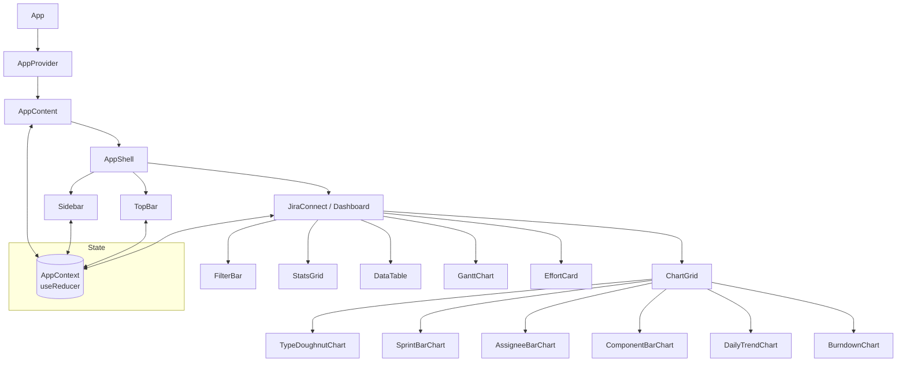
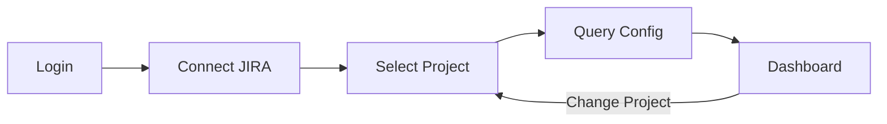
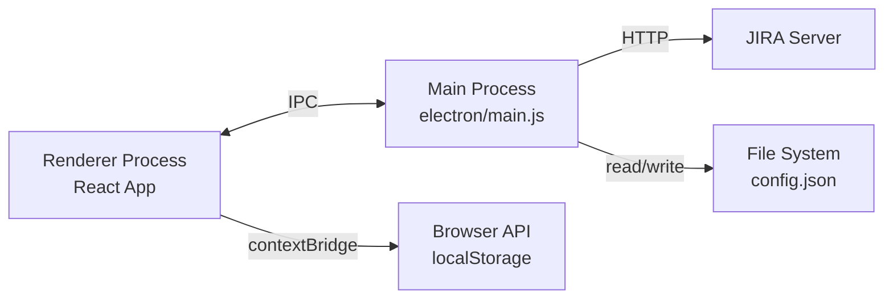

<div align="center">
  <h1>📊 JIRA Time Tracking Dashboard</h1>
  <p>
    
    
    
    
    
    
    
  </p>
  <p><em>Ứng dụng web đơn trang (SPA) giúp trực quan hóa dữ liệu thời gian làm việc từ JIRA</em></p>
</div>

---

## 📖 Giới thiệu

**JIRA Time Tracking Dashboard** là ứng dụng web đơn trang (Single Page Application) được xây dựng với React 19, cho phép nhập và phân tích dữ liệu thời gian làm việc từ JIRA qua nhiều kênh khác nhau. 

Ứng dụng hiện hỗ trợ nhập dữ liệu từ **HTML export** từ Excel, **JIRA API** (Basic Auth), và **Bookmarklet** — giúp bạn linh hoạt lựa chọn phương thức phù hợp nhất với quy trình hiện tại.

Sau khi nhập dữ liệu, dashboard cung cấp:
- **Phân tích effort** với biểu đồ trực quan (Chart.js)
- **Quản lý OT và nghỉ phép** với các nút quick-add
- **Gán nhãn** thủ công, hàng loạt hoặc tự động qua auto-rule
- **Lưu snapshot lịch sử**, so sánh delta giữa 2 phiên bản
- **Xuất báo cáo** dạng CSV hoặc JSON
- Giao diện **Dark/Light theme** với hiệu ứng chuyển cảnh Framer Motion
- **Weekly Planner**: lên lịch công việc theo tuần, log worklog

---

## ✨ Tính năng chính

### 🔐 Màn hình đăng nhập bảo vệ app
- Bảo vệ toàn bộ ứng dụng bằng màn hình đăng nhập
- Mã hóa mật khẩu bằng **SHA-256**
- Khóa tài khoản sau **5 lần nhập sai** (tự động mở khóa sau 30 phút)
- **Dark/Light mode** ngay trên màn hình đăng nhập (2 cột)
- Mật khẩu mặc định: `123456aA@`

### 🧭 Flow Wizard
- Luồng thiết lập có hướng dẫn từng bước:
  1. **Đăng nhập** → 2. **Kết nối JIRA** → 3. **Chọn Project** (grid card) → 4. **Cấu hình Query** → 5. **Dashboard**
- Project selector dạng grid card với tìm kiếm
- Nút đổi dự án từ Dashboard (quay lại bước chọn Project)

### 📥 Import dữ liệu

| Phương thức | Mô tả |
|-------------|-------|
| **HTML** | Export Excel (HTML Table) từ JIRA (All fields) → import qua sidebar |
| **JIRA API** | Nhập URL, Email, API Token, Project Key → tự động fetch dữ liệu |
| **Bookmarklet** | Tạo bookmark → click trên tab JIRA → tự động thu thập và gửi dữ liệu |

### 📊 Dashboard phân tab

| Tab | Mô tả |
|-----|-------|
| **Tổng quan** | Biểu đồ, thống kê, FilterBar |
| **Dữ liệu** | DataTable chi tiết từng task |
| **Gantt** | Biểu đồ Gantt timeline |
| **So sánh** | So sánh dữ liệu theo tháng / snapshot |

### Biểu đồ Chart.js
- `TypeDoughnutChart` — Phân bố loại công việc (Bug, Task, Story...)
- `SprintBarChart` — So sánh effort theo Sprint
- `AssigneeBarChart` — Effort theo từng thành viên
- `ComponentBarChart` — Effort theo component
- `DailyTrendChart` — Xu hướng thời gian theo ngày
- `BurndownChart` — Biểu đồ burndown tiến độ
- **Gantt Chart** trực quan theo timeline
- **DataTable** với phân trang, sắp xếp, tìm kiếm
- **Stats Grid** — Thống kê tổng quan (tổng giờ, số task, trung bình...)

### 📈 Effort Tracking

- Tính toán **ratio effort** (thời gian thực tế / ước tính)
- **Gauge bar** trực quan hóa mức độ hoàn thành
- Cảnh báo khi effort vượt ngưỡng cho phép

### ⏱ Quản lý OT & Nghỉ phép

- Bảng nhập OT và nghỉ phép riêng biệt
- **Quick-add buttons**: thêm nhanh giờ OT hoặc ngày nghỉ
- Tự động tính tổng và hiển thị trên dashboard

### 🏷 Quản lý nhãn (Label Manager)

- **Tạo nhãn** với màu sắc tùy chỉnh
- **Gán nhãn thủ công** từng task hoặc **hàng loạt** (bulk select)
- **Auto-rule**: thiết lập quy tắc tự động gán nhãn dựa trên điều kiện (component, assignee, loại task...)
- **Trình soạn thảo rule** (`RuleEditor`) trực quan

### 💾 Lịch sử (History Manager)

- **Lưu snapshot** dữ liệu hiện tại
- **Xem lại** các snapshot đã lưu
- **So sánh delta** giữa 2 bản (so sánh khác biệt về effort, số lượng task...)
- Lưu trữ trong `localStorage` và có thể xuất ra file

### 📅 Weekly Planner

- Lên lịch công việc theo tuần (thứ 2 → thứ 6)
- Tự động load tasks từ JIRA
- Kéo-thả / chọn task vào từng ngày
- **Log worklog** trực tiếp lên JIRA
- Lưu kế hoạch vào `localStorage`
- Theo dõi tiến độ theo giờ (mục tiêu 35h/tuần)

### 🌓 Giao diện

- **Dark/Light theme** với CSS variables, chuyển đổi ngay từ màn hình đăng nhập
- **Framer Motion** animation cho chuyển cảnh mượt mà
- **Sidebar** thu gọn/mở rộng, phân cấp menu Dashboard (cha-con)
- **Responsive** — hỗ trợ mobile và desktop
- Font **Consolas** toàn bộ ứng dụng

### 🖥 Electron Desktop App

- Ứng dụng desktop độc lập với Electron
- **SSO Login** với Microsoft (qua JIRA)
- **Cookie persistence** — giữ phiên đăng nhập qua các lần khởi động
- IPC bridge cho phép renderer gọi JIRA API mà không bị CORS
- Build portable `.exe` với electron-builder

### 📤 Xuất báo cáo

- Xuất dữ liệu hiện tại ra file **CSV**
- Xuất ra file **JSON** (bao gồm cả nhãn và OT)

---

## 🆕 Tính năng mới trong v1.2.0

| Tính năng | Mô tả |
|-----------|-------|
| 🔐 Màn hình đăng nhập | Bảo vệ app bằng SHA-256, khóa sau 5 lần sai |
| 🧭 Flow Wizard | Login → Connect JIRA → Select Project → Config → Dashboard |
| 📅 Weekly Planner | Lên lịch tuần, auto-load JIRA tasks, log worklog |
| 🗂️ Dashboard phân tab | Tổng quan / Dữ liệu / Gantt / So sánh |
| 🌓 Dark/Light mode | Trên màn hình đăng nhập (thiết kế 2 cột) |
| 🃏 Project selector | Dạng grid card, tìm kiếm, hiện đại |
| 🔄 Đổi dự án | Nút từ Dashboard, quay lại bước chọn Project |
| ✏️ Font Consolas | Đổi toàn bộ font sang Consolas |
| 📐 Sidebar phân cấp | Dashboard menu cha-con |

---

## 🛠 Công nghệ sử dụng

| Công nghệ | Phiên bản | Mục đích |
|-----------|-----------|----------|
| **React** | ^19.0.0 | UI library, component-based architecture |
| **Vite** | ^6.0.0 | Build tool, dev server với HMR nhanh |
| **Tailwind CSS** | ^4.0.0 | Utility-first CSS framework |
| **Framer Motion** | ^12.0.0 | Animation & transition |
| **Chart.js** | ^4.4.7 | Biểu đồ dạng canvas hiệu suất cao |
| **react-chartjs-2** | ^5.3.0 | React wrapper cho Chart.js |
| **Lucide React** | ^0.400.0 | Icon library (hỗ trợ tree-shaking) |
| **Electron** | ^42.5.0 | Desktop application shell |
| **electron-builder** | ^26.15.3 | Build & package desktop app |
| **Context API + useReducer** | — | State management toàn cục |
| **@vitejs/plugin-react** | ^4.3.4 | React Fast Refresh cho Vite |
| **@tailwindcss/vite** | ^4.0.0 | Tailwind CSS Vite plugin |

---

## 🚀 Cài đặt & Chạy

### Yêu cầu
- **Node.js** ≥ 18
- **npm** ≥ 9

### Cài đặt

```bash
git clone https://github.com/thongnmetc-arch/jira-dashboard.git
cd jira-dashboard
npm install
```

### Chạy môi trường phát triển (Web)

```bash
npm run dev
```

Truy cập [http://localhost:5173](http://localhost:5173) — dev server với HMR (Hot Module Replacement).

Mật khẩu đăng nhập mặc định: `123456aA@`

### Build production

```bash
npm run build
```

Build output tại thư mục `dist/`. Chạy preview:

```bash
npm run preview
```

### Electron Desktop App

#### Chạy môi trường phát triển (Electron + Vite)

```bash
npm run electron:dev
```

Khởi động đồng thời Vite dev server (localhost:5173) và cửa sổ Electron.

#### Build portable .exe

```bash
npm run electron:build
```

Tạo file `release/JIRA-Dashboard.exe` (portable, không cần cài đặt).

#### Build NSIS installer

```bash
npm run electron:dist
```

---

## 🔨 Build file .exe (Windows)

### Yêu cầu
- **Node.js 18+** — tải từ https://nodejs.org
- **Windows** — bản build `--win portable` chỉ hoạt động trên Windows
- **Git** — để clone repository

### Các bước
```bash
# 1. Clone repository
git clone https://github.com/thongnmetc-arch/jira-dashboard.git
cd jira-dashboard

# 2. Cài đặt dependencies
npm install

# 3. Build file .exe portable (1 file duy nhất, không cần cài đặt)
npm run electron:build
```

Sau khi build xong, file `JIRA-Dashboard.exe` sẽ nằm trong thư mục `release/`.
Copy file này sang máy khác là chạy được ngay — không cần cài Node.js hay bất kỳ thứ gì khác.

### Diễn giải lệnh build
```
npm run electron:build
  ├── vite build                    ← Build React app → thư mục dist/
  └── electron-builder --win portable  ← Đóng gói thành 1 file .exe
```

### Lưu ý
- File `.exe` có dung lượng ~100-150 MB (bao gồm Chromium + Node.js runtime)
- Chỉ cần copy 1 file `JIRA-Dashboard.exe` — chạy trực tiếp, không cần cài đặt
- Nếu dùng JIRA API trong app Electron, đảm bảo máy có kết nối mạng đến JIRA server

---

## 📋 Cách sử dụng

### 1. Đăng nhập
Khi mở ứng dụng, bạn sẽ thấy màn hình đăng nhập 2 cột:
- Bên trái: form đăng nhập (tên đăng nhập, mật khẩu)
- Bên phải: giới thiệu tính năng
- Mật khẩu mặc định: `123456aA@`
- Có nút chuyển **Dark/Light mode**

### 2. Flow Wizard thiết lập

Sau khi đăng nhập, wizard hướng dẫn từng bước:
1. **Kết nối JIRA** — nhập URL, Email, API Token
2. **Chọn Project** — grid card với tìm kiếm
3. **Cấu hình** — JQL, Assignee filter
4. **Dashboard** — tự động load dữ liệu

### 3. Nhập dữ liệu

#### HTML (Excel export)
1. Trong JIRA, vào tab **Issues** → **Export** → **Excel (HTML)**
2. Mở file HTML trong trình duyệt (hoặc kéo vào dashboard)
3. Sidebar sẽ tự động phát hiện và import dữ liệu

#### JIRA API
1. Mở **JIRA Connect** panel từ sidebar
2. Nhập:
   - **URL** server JIRA (vd: `https://your-domain.atlassian.net`)
   - **Email** đăng nhập
   - **API Token** (tạo tại [Atlassian API Tokens](https://id.atlassian.com/manage-profile/security/api-tokens))
   - **Project Key** (vd: `PROJ`)
3. Nhấn **Connect** → dữ liệu tự động fetch

#### Bookmarklet
1. Tạo bookmark mới trong trình duyệt
2. Dán đoạn script bookmarklet (xem trong sidebar → Bookmarklet)
3. Mở tab JIRA, click bookmark → tự động thu thập và gửi dữ liệu

### 4. Khám phá Dashboard

Sau khi có dữ liệu, dashboard phân 4 tab:
- **Tổng quan**: StatsGrid + ChartGrid + FilterBar
- **Dữ liệu**: DataTable chi tiết (sort, search, page)
- **Gantt**: Biểu đồ Gantt timeline
- **So sánh**: MonthComparison + CompareView

### 5. Weekly Planner

- Mở từ sidebar → **Weekly Planner**
- Chọn tuần bằng nút điều hướng (← →)
- Tasks từ JIRA hiện ở cột bên trái
- Kéo thả hoặc click + để thêm task vào từng ngày
- Nhập số giờ làm việc
- Nhấn **Log Worklog** để ghi lên JIRA

### 6. Quản lý OT & Nghỉ phép

- Click vào **OT Panel** trong sidebar
- Thêm giờ OT với nút **+ OT**
- Thêm ngày nghỉ với nút **+ Nghỉ phép**
- Tổng OT và nghỉ phép hiển thị trên dashboard

### 7. Gán nhãn

- Mở **Label Manager** từ sidebar
- **Tạo nhãn mới** với tên và màu sắc
- **Gán thủ công**: chọn task → chọn nhãn từ dropdown
- **Gán hàng loạt**: chọn nhiều task → gán nhãn cùng lúc
- **Auto-rule**: thêm quy tắc tự động (vd: "Component = Backend → gán nhãn Backend")

### 8. Lưu & So sánh lịch sử

- Mở **History** từ sidebar
- **Lưu snapshot**: đặt tên → lưu trạng thái hiện tại
- **Xem snapshot**: click vào tên để khôi phục dữ liệu
- **So sánh**: chọn 2 snapshot → xem bảng delta khác biệt

---

## 📁 Cấu trúc thư mục

```
jira-dashboard/
├── electron/
│   ├── main.js          # Main process Electron (IPC, SSO, cookie)
│   ├── preload.js       # Preload script (contextBridge API)
│   └── package.json     # Electron dependencies
│
├── src/
│   ├── main.jsx         # Entry point React
│   ├── App.jsx          # Root component + wizard flow + login gate
│   ├── index.css        # Tailwind CSS + CSS variables (themes)
│   │
│   ├── components/
│   │   ├── layout/
│   │   │   ├── AppShell.jsx     # Khung ứng dụng chính
│   │   │   ├── Sidebar.jsx      # Sidebar điều hướng (dashboard cha-con)
│   │   │   └── TopBar.jsx       # Thanh công cụ trên cùng
│   │   │
│   │   ├── charts/
│   │   │   ├── AssigneeBarChart.jsx
│   │   │   ├── BurndownChart.jsx
│   │   │   ├── ComponentBarChart.jsx
│   │   │   ├── DailyTrendChart.jsx
│   │   │   ├── SprintBarChart.jsx
│   │   │   └── TypeDoughnutChart.jsx
│   │   │
│   │   ├── LoginScreen.jsx      # Màn hình đăng nhập (SHA-256, dark/light)
│   │   ├── Dashboard.jsx        # Trang dashboard chính (phân tab)
│   │   ├── DashboardTabs.jsx    # Tab navigator (Tổng quan/Dữ liệu/Gantt/So sánh)
│   │   ├── WeeklyPlanner.jsx    # Lên lịch tuần + log worklog
│   │   ├── ProjectSelector.jsx  # Chọn project dạng grid card
│   │   ├── QueryConfig.jsx      # Cấu hình query JIRA
│   │   ├── ChartGrid.jsx        # Grid hiển thị các biểu đồ
│   │   ├── DataTable.jsx        # Bảng dữ liệu (sort, search, page)
│   │   ├── EffortCard.jsx       # Thẻ effort (gauge, ratio)
│   │   ├── FilterBar.jsx        # Thanh lọc dữ liệu (gọn 1 hàng)
│   │   ├── GanttChart.jsx       # Biểu đồ Gantt
│   │   ├── StatsGrid.jsx        # Thống kê tổng quan
│   │   ├── TaskDetail.jsx       # Chi tiết task
│   │   │
│   │   ├── UploadZone.jsx       # Kéo thả file HTML
│   │   ├── JiraConnect.jsx      # Kết nối JIRA API
│   │   ├── OTPanel.jsx          # Quản lý OT/Nghỉ phép
│   │   │
│   │   ├── LabelManager.jsx     # Quản lý nhãn
│   │   ├── LabelBadge.jsx       # Badge hiển thị nhãn
│   │   ├── LabelDropdown.jsx    # Dropdown chọn nhãn
│   │   ├── LabelFilter.jsx      # Lọc theo nhãn
│   │   ├── RuleEditor.jsx       # Soạn thảo auto-rule
│   │   │
│   │   ├── HistoryPanel.jsx     # Quản lý snapshot lịch sử
│   │   ├── CompareView.jsx      # So sánh delta 2 bản
│   │   ├── MonthComparison.jsx  # So sánh theo tháng
│   │   └── AutoReport.jsx       # Tự động tạo báo cáo
│   │
│   ├── context/
│   │   └── AppContext.jsx       # State toàn cục (Context API + useReducer)
│   │
│   └── utils/
│       ├── authUtils.js         # Xác thực SHA-256, lockout
│       ├── jiraWorklog.js       # Log worklog lên JIRA
│       ├── csvParser.js         # Parse file CSV
│       ├── htmlParser.js        # Parse HTML export từ JIRA
│       ├── jiraApi.js           # Gọi JIRA REST API
│       ├── dateUtils.js         # Tiện ích xử lý ngày tháng
│       ├── effortCalculator.js  # Tính toán effort ratio
│       ├── labelUtils.js        # Logic gán nhãn & auto-rule
│       ├── historyUtils.js      # Lưu/xóa/so sánh snapshot
│       └── exportUtils.js       # Xuất CSV/JSON
│
├── docs/
│   ├── features/         # Tài liệu tính năng
│   ├── intel/            # Tài liệu kiến trúc & phân tích
│   └── modules/          # Tài liệu module
│
├── public/               # Static assets
├── dist/                 # Build output (generated)
├── release/              # Electron release (generated)
│
├── index.html            # HTML entry point
├── vite.config.js        # Vite configuration
├── package.json          # Dependencies & scripts
└── README.md             # (this file)
```

---

## 🏗 Kiến trúc

### State Management

Ứng dụng sử dụng **Context API + `useReducer`** để quản lý state toàn cục.

- **AppContext** (`src/context/AppContext.jsx`) chứa toàn bộ state của ứng dụng
- **Reducer pattern** giúp state transitions rõ ràng, dễ debug
- Các action điển hình: `SET_TASKS`, `SET_FILTERS`, `SET_OT_LEAVE`, `SET_DARK_MODE`...



### Flow Wizard



### Luồng dữ liệu

1. **Login** → xác thực SHA-256, kiểm tra lockout
2. **Wizard** → Connect → Select Project → Query Config
3. **Import**: User nhập dữ liệu qua HTML / API / Bookmarklet
4. **Parse**: File được parse bởi các utility (`htmlParser`, `jiraApi`)
5. **Dispatch**: Dữ liệu được gửi vào `AppContext` qua action `SET_TASKS`
6. **Label sync**: Label auto-rule chạy, gán nhãn tự động
7. **Render**: Dashboard re-render với dữ liệu mới
8. **Filter/Sort**: User lọc, sắp xếp, tìm kiếm — state cập nhật → re-render
9. **Export/Lưu**: User xuất CSV/JSON hoặc lưu snapshot lịch sử

### Electron Architecture



Trong môi trường Electron, renderer giao tiếp với main process qua IPC bridge (`preload.js`). Main process xử lý:
- Đăng nhập SSO (mở cửa sổ JIRA login)
- Quản lý cookie session
- Gọi JIRA API (vượt CORS)
- Lưu trữ cấu hình xuống file system

---

## 📄 Giấy phép

Dự án được phân phối dưới giấy phép **MIT**. Xem file [LICENSE](LICENSE) để biết thêm chi tiết.

---

## 📋 Lịch sử phiên bản

Xem [CHANGELOG.md](CHANGELOG.md) để biết chi tiết các phiên bản.

---

<div align="center">
  <p>🚀 <strong>JIRA Time Tracking Dashboard</strong> — Trực quan hóa thời gian làm việc, tối ưu hiệu suất đội nhóm</p>
</div>
