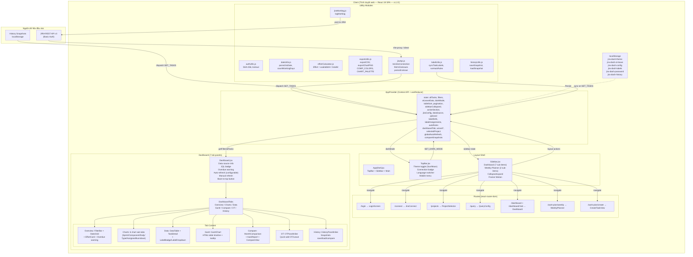

# Tài liệu Đặc tả Yêu cầu Phần mềm (SRS)

## JIRA Time Tracking Dashboard

| Trường           | Nội dung                                                     |
|------------------|---------------------------------------------------------------|
| **Dự án**        | JIRA Time Tracking Dashboard                                  |
| **Phiên bản**    | v1.2.0                                                        |
| **Ngày**         | 04/07/2026                                                    |
| **Tác giả**      | AI Studio Agent                                               |
| **Trạng thái**   | Đã phát hành                                                   |

---

## Mục lục

- [1. Giới thiệu](#1-giới-thiệu)
  - [1.1 Mục đích](#11-mục-đích)
  - [1.2 Phạm vi dự án](#12-phạm-vi-dự-án)
  - [1.3 Đối tượng độc giả](#13-đối-tượng-độc-giả)
  - [1.4 Thuật ngữ và từ viết tắt](#14-thuật-ngữ-và-từ-viết-tắt)
  - [1.5 Tài liệu tham khảo](#15-tài-liệu-tham-khảo)
- [2. Tổng quan sản phẩm](#2-tổng-quan-sản-phẩm)
  - [2.1 Góc nhìn sản phẩm](#21-góc-nhìn-sản-phẩm)
  - [2.2 Kiến trúc tổng thể](#22-kiến-trúc-tổng-thể)
  - [2.3 Đối tượng người dùng](#23-đối-tượng-người-dùng)
  - [2.4 Môi trường hoạt động](#24-môi-trường-hoạt-động)
  - [2.5 Ràng buộc thiết kế và triển khai](#25-ràng-buộc-thiết-kế-và-triển-khai)
- [3. Yêu cầu chức năng](#3-yêu-cầu-chức-năng)
  - [FR-01: Nhập file CSV JIRA](#fr-01-nhập-file-csv-jira)
  - [FR-02: Dashboard thống kê (Stats Cards)](#fr-02-dashboard-thống-kê-stats-cards)
  - [FR-03: Biểu đồ phân tích](#fr-03-biểu-đồ-phân-tích)
  - [FR-04: Biểu đồ Gantt](#fr-04-biểu-đồ-gantt)
  - [FR-05: Bộ lọc dữ liệu](#fr-05-bộ-lọc-dữ-liệu)
  - [FR-06: Bảng dữ liệu chi tiết](#fr-06-bảng-dữ-liệu-chi-tiết)
  - [FR-07: Xuất báo cáo](#fr-07-xuất-báo-cáo)
  - [FR-08: Lưu & So sánh lịch sử](#fr-08-lưu--so-sánh-lịch-sử)
  - [FR-09: Tích hợp JIRA API](#fr-09-tích-hợp-jira-api)
  - [FR-10: Tính Effort](#fr-10-tính-effort)
  - [FR-11: Quản lý OT & Nghỉ phép](#fr-11-quản-lý-ot--nghỉ-phép)
  - [FR-12: Gán nhãn tùy chỉnh](#fr-12-gán-nhãn-tùy-chỉnh)
  - [FR-13: Chế độ Dark/Light Theme](#fr-13-chế-độ-darklight-theme)
  - [FR-14: Màn hình đăng nhập](#fr-14-màn-hình-đăng-nhập)
  - [FR-15: Flow Wizard](#fr-15-flow-wizard)
  - [FR-16: Weekly Planner](#fr-16-weekly-planner)
  - [FR-17: Create Task](#fr-17-create-task)
  - [FR-18: Dashboard Tabs](#fr-18-dashboard-tabs)
  - [FR-19: Global Auto-refresh](#fr-19-global-auto-refresh)
- [4. Yêu cầu phi chức năng](#4-yêu-cầu-phi-chức-năng)
  - [4.1 Hiệu năng](#41-hiệu-năng)
  - [4.2 Khả năng sử dụng](#42-khả-năng-sử-dụng)
  - [4.3 Độ tin cậy](#43-độ-tin-cậy)
  - [4.4 Bảo mật](#44-bảo-mật)
  - [4.5 Khả năng bảo trì](#45-khả-năng-bảo-trì)
  - [4.6 Tương thích](#46-tương-thích)
- [5. Yêu cầu giao diện người dùng](#5-yêu-cầu-giao-diện-người-dùng)
  - [5.1 Bố cục tổng thể](#51-bố-cục-tổng-thể)
  - [5.2 Bảng màu & Typography](#52-bảng-màu--typography)
  - [5.3 Ngôn ngữ](#53-ngôn-ngữ)
- [6. Phụ lục](#6-phụ-lục)
  - [6.1 Phân kỳ phát triển](#61-phân-kỳ-phát-triển)
  - [6.2 Ma trận vết (Requirements Traceability Matrix)](#62-ma-trận-vết-requirements-traceability-matrix)

---

## 1. Giới thiệu

### 1.1 Mục đích

Tài liệu này đặc tả các yêu cầu phần mềm cho hệ thống **JIRA Time Tracking Dashboard** — một ứng dụng web đơn trang (SPA) sử dụng **React 19 + react-router-dom** cho phép người dùng kết nối đến JIRA qua REST API, trực quan hóa số liệu thời gian làm việc qua các biểu đồ và bảng thống kê, đồng thời hỗ trợ tính toán mức độ hoàn thành công việc (effort), quản lý tăng ca (OT) và nghỉ phép, xuất báo cáo, và so sánh dữ liệu theo thời gian.

### 1.2 Phạm vi dự án

Hệ thống hoạt động hoàn toàn trên trình duyệt web (client-side), không yêu cầu máy chủ backend. Dữ liệu được xử lý và lưu trữ trong bộ nhớ trình duyệt (localStorage). Các chức năng bao gồm:

- **Phase 1 (Đã hoàn thành):** Nhập file CSV JIRA, dashboard thống kê, 5 biểu đồ Chart.js, biểu đồ Gantt HTML/CSS.
- **Phase 2 (Đã hoàn thành):** Bộ lọc dữ liệu tương tác, bảng dữ liệu chi tiết có phân trang/sắp xếp/tìm kiếm, xuất báo cáo (CSV/PNG), tính toán effort theo công thức ratio mới, quản lý OT và nghỉ phép đơn giản hóa (không chọn ngày — chỉ nhập tổng số giờ + quick-add buttons).
- **Phase 3 (Đã hoàn thành):** Lưu và so sánh lịch sử phân tích, tích hợp JIRA API (API Token), gán nhãn tùy chỉnh cho công việc. Tất cả tính năng Phase 3 đã được tích hợp và hoàn thiện.
- **Phase 4 (Đã hoàn thành):** Chuyển đổi kiến trúc từ single HTML file sang **React 19 SPA với Vite, Tailwind CSS, Framer Motion**. Bao gồm 28+ source file, 18+ components (layout/: AppShell, Sidebar, TopBar), Context API state management, dark/light theme, sidebar navigation, sticky layout, data source indicator, floating back-to-top button, overdue warning banner.
- **Phase 5 (Đã hoàn thành):** Bổ sung routing với **react-router-dom** với 7 tab dashboard (Overview, Charts, Data, Gantt, Compare, OT, History). Hỗ trợ đa ngôn ngữ (Tiếng Việt/Tiếng Anh) qua i18n. Triển khai Docker + Kubernetes (Dockerfile, docker-compose.yml, k8s/). Lọc toàn cục task Cancelled. Cải tiến hiển thị Effort (dual mode). Thiết kế lại màn hình wizard + login. Xoá dependency HTML import và Bookmarklet.
- **Phase 6 (Đã hoàn thành — v1.2.0):** Màn hình đăng nhập bảo vệ app (SHA-256, khóa 5 lần sai, 2 cột dark/light). Flow Wizard 5 bước (Login → Connect → Select Project → Query Config → Dashboard). Weekly Planner với log worklog lên JIRA. Create Task View. Dashboard phân tab với 7 tab. Project Selector dạng grid card. Nút đổi dự án từ Dashboard. Font Consolas toàn bộ ứng dụng. Sidebar phân cấp dashboard cha-con.

**Ngoài phạm vi:** Tích hợp với các hệ thống quản lý dự án khác ngoài JIRA, xác thực người dùng đa cấp, triển khai đa người dùng dùng chung dữ liệu qua mạng.

### 1.3 Đối tượng độc giả

| Đối tượng               | Mục đích sử dụng tài liệu                                |
|--------------------------|----------------------------------------------------------|
| Nhóm phát triển          | Hiểu yêu cầu, thiết kế và triển khai các tính năng      |
| Nhóm kiểm thử (QA)       | Xây dựng kịch bản kiểm thử dựa trên tiêu chí chấp nhận  |
| Quản lý dự án            | Đánh giá tiến độ và phạm vi                             |
| Người dùng cuối          | Nắm được các tính năng và cách vận hành hệ thống        |

### 1.4 Thuật ngữ và từ viết tắt

| Thuật ngữ / Viết tắt | Giải thích                                                              |
|-----------------------|-------------------------------------------------------------------------|
| JIRA                  | Hệ thống quản lý dự án và theo dõi công việc của Atlassian              |
| CSV                   | Comma-Separated Values — định dạng tập tin dữ liệu dạng bảng            |
| SRS                   | Software Requirements Specification — Đặc tả yêu cầu phần mềm           |
| Chart.js              | Thư viện JavaScript vẽ biểu đồ trên HTML Canvas                         |
| CDN                   | Content Delivery Network — mạng phân phối nội dung tĩnh                  |
| Effort                | Tỷ lệ % giờ làm việc thực tế so với giờ làm việc tiêu chuẩn             |
| OT                    | Overtime — Tăng ca / giờ làm thêm                                       |
| localStorage          | API lưu trữ dữ liệu phiên trong trình duyệt web                          |
| DOM                   | Document Object Model — mô hình cây tài liệu HTML                       |
| REST API              | Kiến trúc giao tiếp web qua HTTP (dùng cho JIRA API)                    |
| API Token             | Mã xác thực dùng để gọi JIRA API thay vì mật khẩu                       |
| Sprint                | Chu kỳ phát triển ngắn hạn trong phương pháp Scrum                      |
| Component (Phân hệ)   | Nhóm chức năng / mô-đun trong dự án JIRA                                |
| Gantt                 | Biểu đồ thanh ngang biểu diễn tiến độ công việc theo thời gian          |
| RTM                   | Requirements Traceability Matrix — Ma trận truy xuất yêu cầu             |
| React                 | Thư viện JavaScript xây dựng giao diện người dùng của Meta              |
| Vite                  | Build tool thế hệ mới cho ứng dụng web (npm run dev / build)             |
| Tailwind CSS          | Framework CSS utility-first, hỗ trợ dark mode qua `dark:` prefix        |
| Framer Motion         | Thư viện animation cho React (AnimatePresence, stagger, layout)          |
| Context API           | Cơ chế quản lý state toàn cục của React (useReducer + useContext)       |
| SPA                   | Single-Page Application — ứng dụng web đơn trang                        |
| HMR                   | Hot Module Replacement — thay thế module nóng khi phát triển             |

### 1.5 Tài liệu tham khảo

| Tài liệu                                                        | Mô tả                                            |
|-----------------------------------------------------------------|--------------------------------------------------|
| `jira-dashboard-react/` (thư mục dự án hiện tại)                | Mã nguồn React SPA (35+ source files, 28+ components) |
| Chart.js Documentation v4 (https://www.chartjs.org/docs/latest/)| Thư viện biểu đồ sử dụng trong dự án              |
| IEEE Std 830-1998 — Recommended Practice for SRS               | Chuẩn cấu trúc tài liệu đặc tả yêu cầu            |
| JIRA Cloud REST API v3 (Atlassian)                              | API tích hợp tùy chọn để lấy dữ liệu trực tiếp     |
| React 19 Documentation (https://react.dev/)                     | Thư viện UI framework                             |
| Vite Documentation (https://vite.dev/)                          | Build tool và dev server                          |
| Tailwind CSS v4 (https://tailwindcss.com/)                      | Framework CSS utility-first                       |
| Framer Motion (https://www.framer.com/motion/)                  | Thư viện animation cho React                      |
| react-chartjs-2 (https://react-chartjs-2.js.org/)               | React wrapper cho Chart.js                        |
| Lucide React (https://lucide.dev/)                              | Bộ icon cho React                                 |
| react-router-dom v6 (https://reactrouter.com/)                  | Client-side routing cho React                     |

---

## 2. Tổng quan sản phẩm

### 2.1 Góc nhìn sản phẩm

**JIRA Time Tracking Dashboard** là một ứng dụng web đơn trang (Single-Page Application — SPA) xây dựng với **React 19 + Vite + react-router-dom**, chạy hoàn toàn trên trình duyệt. Sản phẩm cho phép:

1. Người dùng đăng nhập bằng mật khẩu (SHA-256, khóa sau 5 lần sai) qua màn hình login 2 cột dark/light.
2. Flow Wizard 5 bước hướng dẫn: Login → Kết nối JIRA (API Token) → Chọn Project (grid card) → Cấu hình Query (JQL) → Dashboard.
3. Kết nối đến JIRA qua **API Token (Basic Auth)**, tự động fetch dữ liệu issues qua REST API.
4. Dashboard tự động phân tích dữ liệu, hiển thị thống kê tổng quan và 6 biểu đồ trực quan (Chart.js) với các sub-tab.
5. Người dùng tương tác với dữ liệu qua bộ lọc (pill-style compact), bảng chi tiết (sortable, searchable, paginated), và biểu đồ Gantt.
6. Tính toán tỷ lệ effort dưới dạng **ratio** (availableHr / totalHr) với gauge bar màu sắc và cảnh báo nếu effort > 1.
7. Quản lý OT & nghỉ phép đơn giản hóa — chỉ nhập tổng số giờ (không chọn ngày) với quick-add buttons (OT: +0.5h, +1.5h, +2h, +4h, +8h; Leave: +1.75h, +3.5h, +7h, +14h).
8. Chuyển đổi giao diện sáng/tối (dark/light theme) với animation mượt mà (0.2s transitions).
9. **7 tab Dashboard**: Tổng quan, Charts, Dữ liệu, Gantt, So sánh, OT, Lịch sử.
10. **Weekly Planner**: Lên lịch công việc theo tuần, tự động load tasks từ JIRA, log worklog trực tiếp lên JIRA.
11. **Create Task**: Tạo task JIRA mới từ ứng dụng.
12. Gán nhãn thủ công, hàng loạt hoặc tự động qua auto-rule.
13. Lưu snapshot lịch sử, so sánh delta giữa 2 phiên bản.
14. Bố cục với **sticky TopBar**, **Sidebar** (collapse/expand, phân cấp Dashboard + Weekly Planner).
15. Các UI/UX bổ sung: **data source indicator** (JIRA API + JQL + task count), **overdue task warning** (đỏ — task chưa đóng), **back to top button** (floating bottom-right), **notification banner** khi OT/Leave được lưu, **auto-refresh** interval configurable.

**Giá trị cốt lõi:**
- Không cần cài đặt máy chủ — build thành file tĩnh trong thư mục `dist/`, mở trực tiếp từ ổ cứng hoặc deploy lên web server.
- Toàn bộ dữ liệu xử lý trên client — không lo rò rỉ dữ liệu qua mạng.
- Kết nối JIRA qua API Token (Basic Auth) với Vite proxy trong dev mode (bypass CORS).
- Kiến trúc component-based (React) dễ mở rộng, bảo trì.
- Client-side routing với react-router-dom (8 routes).
- CSS utility-first (Tailwind) với dark mode tích hợp sẵn.
- Bảo vệ ứng dụng bằng màn hình đăng nhập SHA-256.
- Hỗ trợ đa ngôn ngữ (Tiếng Việt / English).

### 2.2 Kiến trúc tổng thể



**Luồng dữ liệu chính (v1.2.0):**

1. **Đăng nhập:** `LoginScreen.jsx` xác thực mật khẩu SHA-256, kiểm tra lockout. `ProtectedRoute` kiểm tra `isPasswordSet()` trước khi render.
2. **Wizard Flow 5 bước:** Login → `/connect` (JiraConnect: nhập URL + API Token) → `/projects` (ProjectSelector: grid card + search) → `/query` (QueryConfig: JQL + Assignee) → `/dashboard` (tự động fetch issues và render).
3. **Kết nối JIRA API:** `jiraApi.js` (`testJiraConnection` → `fetchJiraIssues`) → gọi `/rest/api/latest/search?jql=...` → `parseJiraIssue()` map response → dispatch `SET_TASKS`. Trong dev mode, request qua Vite proxy (`/api/jira`) để bypass CORS.
4. **State:** Dữ liệu được dispatch vào `AppContext` (useReducer). `labelUtils.syncTaskLabels()` và `runAutoRules()` chạy tự động. State lưu `dataSource` ('csv'|'jira'|'history'), `jqlUsed`, `jiraConfig`, `lastRefreshTime`.
5. **Render:** `Dashboard.jsx` dùng `useParams()` từ react-router-dom để xác định tab hiện tại. `AnimatePresence` chuyển đổi giữa các tab panel.
6. **User Interaction:** `FilterBar` dispatch `SET_FILTERS` → state thay đổi → re-render. `OTPanelInline` dispatch `SET_OT_LEAVE`. `HistoryPanelInline` dispatch snapshot actions.
7. **Auto-refresh:** Configurable interval (5/15/30/60 phút) tự động fetch dữ liệu mới từ JIRA API.
8. **Dark mode & i18n:** `TopBar` dispatch `SET_DARK_MODE` + chuyển đổi ngôn ngữ (VI/EN).
9. **Weekly Planner:** `/work-plan/weekly` load tasks từ JIRA, cho phép lên lịch từng ngày và log worklog lên JIRA qua `jiraWorklog.js`.

### 2.3 Đối tượng người dùng

| Nhóm người dùng    | Mô tả                                                              | Nhu cầu chính                                          |
|--------------------|--------------------------------------------------------------------|--------------------------------------------------------|
| Quản lý dự án      | Theo dõi tiến độ và năng suất đội ngũ qua các sprint               | Effort %, Gantt, so sánh lịch sử                       |
| Thành viên nhóm    | Xem phân bổ thời gian của cá nhân, các đầu việc đã thực hiện        | Bảng chi tiết, lọc theo assignee                       |
| Báo cáo dự án      | Tổng hợp số liệu cho báo cáo tuần/tháng cho cấp trên               | Xuất CSV/PNG, thống kê tổng quan                       |
| QA / Test         | Kiểm tra khối lượng công việc liên quan đến các phân hệ/module      | Lọc theo component, bảng dữ liệu chi tiết              |

### 2.4 Môi trường hoạt động

| Yếu tố             | Yêu cầu                                                           |
|--------------------|-------------------------------------------------------------------|
| **Trình duyệt**    | Google Chrome 90+, Firefox 90+, Edge 90+, Safari 15+              |
| **Hệ điều hành**   | Windows 10+, macOS 11+, Linux (bản phân phối phổ biến)             |
| **Kết nối mạng**   | Cần kết nối Internet khi cài đặt lần đầu (npm install). Sau khi build, hoàn toàn offline. |
| **Dung lượng**     | Tối thiểu 256MB RAM, 50MB dung lượng ổ đĩa cho thư mục dist/     |
| **Độ phân giải**   | Tối thiểu 1024×768 px. Tối ưu ở 1366×768 trở lên.                |

### 2.5 Ràng buộc thiết kế và triển khai

1. **React 19 SPA:** Ứng dụng được xây dựng với React 19 (sử dụng React 18 APIs), functional components và hooks. Không dùng class components.
2. **Vite build tool:** Sử dụng Vite 6 làm bundler. Dev server ở `localhost:5173`, production build ở `dist/`. Cấu hình `base: './'` trong `vite.config.js` để tương thích với `file://` protocol.
3. **Vite Proxy cho JIRA API:** Trong dev mode, cấu hình `server.proxy` trong `vite.config.js` chuyển tiếp `/api/jira/*` → JIRA server thật (ví dụ `https://20.84.97.109:3033`) với `changeOrigin: true`, `secure: false`. Cho phép frontend gọi API JIRA mà không bị CORS chặn. Chỉ hoạt động trong dev mode (`npm run dev`).
4. **Không backend:** Không máy chủ, không cơ sở dữ liệu tập trung. Mọi xử lý và lưu trữ trên trình duyệt.
5. **ES Modules:** Mã nguồn dạng ES modules (`import`/`export`), Vite bundle thành file tĩnh khi build.
6. **Tailwind CSS:** Toàn bộ giao diện dùng utility classes. Dark mode qua `dark:` prefix + CSS custom properties (`--color-bg`, `--color-surface`, `--color-text`...). Không có file CSS tùy chỉnh ngoài `index.css` để định nghĩa biến.
7. **Framer Motion:** Animation dùng `AnimatePresence` (mount/unmount), `motion.div` (stagger, layout), `layoutId` (active indicator sidebar), sidebar collapse/expand spring, OT panel slide-in, transition 0.2s cho theme switch.
8. **Lưu trữ cục bộ:** Dùng `localStorage` (giới hạn ~5–10 MB tùy trình duyệt). Keys: `jira-dash-theme` (theme), `jira-dash-ot-leave` (OT/leave), `jira-dash-config` (JIRA connection config).
9. **Layout components:** `AppShell.jsx` (layout shell), `TopBar.jsx` (fixed top bar), `Sidebar.jsx` (fixed left sidebar, collapse/expand), main content `.app-main` cuộn độc lập (scroll).
10. **Giao diện Tiếng Việt:** Toàn bộ nhãn, thông báo, tooltip bằng tiếng Việt, có dấu (Unicode).
11. **Responsive:** Giao diện thích ứng với các kích thước màn hình (mobile ≥ 360px, tablet, desktop). Sidebar trên mobile là overlay drawer (Framer Motion slide từ trái).

---

## 3. Yêu cầu chức năng

### FR-01: Nhập file CSV JIRA

| Trường              | Nội dung                                                          |
|---------------------|-------------------------------------------------------------------|
| **Mã yêu cầu**      | FR-01                                                             |
| **Tên yêu cầu**     | Nhập file CSV JIRA                                                |
| **Phase**           | 1 (Đã hoàn thành)                                                 |
| **Độ ưu tiên**      | Cao                                                               |

#### Mô tả chi tiết

Cho phép người dùng nhập dữ liệu từ file CSV xuất từ JIRA (JIRA native export — "Export CSV"). File CSV sử dụng dấu chấm phẩy (`;`) làm delimiter, mã hóa UTF-8, có thể chứa BOM (Byte Order Mark). Hỗ trợ hai phương thức nhập: kéo-thả (drag-and-drop) và chọn file qua hộp thoại (browse).

#### Đầu vào / Đầu ra

| Loại  | Mô tả                                                              |
|-------|--------------------------------------------------------------------|
| Đầu vào | File CSV định dạng JIRA export, `.csv` extension, ≤ 50 MB        |
| Đầu ra  | Mảng các đối tượng `Task` đã được parse, sẵn sàng cho dashboard    |

#### Cấu trúc object Task sau khi parse

```javascript
{
  key: "BXDBE-5148",            // Issue Key
  summary: "Thực hiện golive...",// Summary
  issueType: "Task",            // Issue Type
  status: "Closed",             // Status
  priority: "Medium",           // Priority
  comps: ["VOS"],               // Component/s (mảng)
  sprints: ["Sprint 9", "Sprint 10"], // Sprint (mảng)
  primarySprint: "Sprint 10",   // Sprint cuối cùng
  timeSpentSec: 25200,          // Time Spent (giây)
  timeSpentHr: 7.0,             // Time Spent (giờ)
  estimateSec: 25200,           // Original Estimate (giây)
  estimateHr: 7.0,              // Original Estimate (giờ)
  created: Date,                // Ngày tạo
  resolved: Date,               // Ngày đóng/resolved
  startDate: Date,              // Custom field Start Date
  assignee: "thongnm@etc.vn",  // Người thực hiện
}
```

#### Luồng xử lý chính

1. Component `UploadZone.jsx` render vùng upload (drag-drop + browse button).
2. Người dùng kéo file CSV vào vùng upload (`.upload-zone`) hoặc nhấn "Chọn file CSV" → mở hộp thoại file.
3. Sự kiện `drop` hoặc `change` kích hoạt → đọc file bằng `FileReader.readAsText(file, 'UTF-8')`.
4. `parseCSV(text)` (trong `utils/csvParser.js`):
   - Xóa BOM nếu có (`\uFEFF` hoặc mã byte EF BB BF).
   - Chuẩn hóa xuống dòng (`\r\n` → `\n`, `\r` → `\n`).
   - 2-pass parse: pass 1 split theo `\n` (xử lý quoted newlines), pass 2 split theo `;` (xử lý quoted fields, escape `""`).
5. `Column Discovery` tìm vị trí các cột bắt buộc (Issue Key, Time Spent, Summary) và tùy chọn (Component/s, Sprint, Assignee…).
6. Kiểm tra dữ liệu: nếu thiếu cột bắt buộc → báo lỗi.
7. Parse từng dòng → object `Task` (file `UploadZone.jsx` hàm `processFile`). Bỏ qua dòng thiếu Issue Key hoặc quá ngắn.
8. Dispatch action `SET_TASKS` vào AppContext → dashboard render.

#### Luồng xử lý thay thế

- **File không đúng định dạng:** Dispatch action `SET_ERROR` với thông báo lỗi.
- **File rỗng hoặc không có dữ liệu hợp lệ:** Thông báo "File CSV không có dữ liệu hợp lệ".
- **Lỗi parse từng dòng:** Ghi log `console.warn` với danh sách dòng lỗi, không dừng xử lý.
- **Dung lượng file quá lớn (>50 MB):** Cảnh báo hiệu năng có thể bị ảnh hưởng.

#### Tiêu chí chấp nhận

- [ ] Kéo-thả file CSV vào vùng upload → dashboard hiển thị dữ liệu.
- [ ] Nhấn "Chọn file CSV" → chọn file → dashboard hiển thị dữ liệu.
- [ ] File CSV có BOM (UTF-8) vẫn parse đúng.
- [ ] File CSV có dòng trống ở cuối được bỏ qua.
- [ ] File CSV có field chứa dấu chấm phẩy trong ngoặc kép được parse đúng.
- [ ] File không đúng định dạng hiển thị thông báo lỗi tương ứng.
- [ ] Lỗi parse không làm dừng toàn bộ quá trình — dashboard vẫn hiển thị với dữ liệu hợp lệ.
- [ ] File CSV với cột thiếu Issue Key hoặc Time Spent → thông báo lỗi có tên cột thiếu.

---

### FR-02: Dashboard thống kê (Stats Cards)

| Trường              | Nội dung                                                          |
|---------------------|-------------------------------------------------------------------|
| **Mã yêu cầu**      | FR-02                                                             |
| **Tên yêu cầu**     | Dashboard thống kê                                                |
| **Phase**           | 1 (Đã hoàn thành)                                                 |
| **Độ ưu tiên**      | Cao                                                               |

#### Mô tả chi tiết

Hiển thị 4 thẻ thống kê tổng quan ở đầu dashboard sau khi tải dữ liệu thành công (file `StatsGrid.jsx`). Mỗi thẻ bao gồm nhãn (label), giá trị số (value), và mô tả phụ (sub). Thẻ thứ 5 (Effort) thuộc FR-10.

#### Các thẻ thống kê

| Thẻ                      | Label                  | Giá trị                                          |
|--------------------------|------------------------|--------------------------------------------------|
| 1 (viền trái tím)        | Tổng số công việc      | `tasks.length`                                   |
| 2 (viền trái xanh)       | Tổng giờ đã log        | `∑ timeSpentHr`, đơn vị giờ (1 số lẻ)            |
| 3 (viền trái cam)        | Tổng giờ ước tính      | `∑ estimateHr`, đơn vị giờ (1 số lẻ)              |
| 4 (viền trái tím nhạt)   | Thời gian TB mỗi task   | `∑ timeSpentHr / tasks.length`, đơn vị giờ       |

#### Luồng xử lý chính

1. `StatsGrid.jsx` nhận `tasks` prop từ `Dashboard.jsx`.
2. `useMemo` tính toán `totalHr`, `totalEst`, `avgHr`.
3. Render 4 thẻ `motion.div` với stagger animation (Framer Motion `cardVariants`, delay mỗi thẻ 0.08s).
4. Thẻ Effort (FR-10) được render trong cùng grid.

#### Tiêu chí chấp nhận

- [ ] Bốn thẻ hiển thị đồng thời, cùng hàng trên desktop (≥ 4 cột).
- [ ] Giá trị số làm tròn đến 1 chữ số thập phân.
- [ ] Khi không có dữ liệu, thẻ hiển thị "—".
- [ ] Các thẻ có hiệu ứng hover + stagger entrance animation.
- [ ] Responsive: trên mobile (<500px) chuyển thành 1 cột; tablet (<900px) 2 cột.
- [ ] Dark mode: nền thẻ chuyển từ `bg-white` sang `dark:bg-slate-800`.

---

### FR-03: Biểu đồ phân tích

| Trường              | Nội dung                                                          |
|---------------------|-------------------------------------------------------------------|
| **Mã yêu cầu**      | FR-03                                                             |
| **Tên yêu cầu**     | Biểu đồ phân tích (5 biểu đồ Chart.js)                            |
| **Phase**           | 1 (Đã hoàn thành)                                                 |
| **Độ ưu tiên**      | Cao                                                               |

#### Mô tả chi tiết

Hiển thị 5 biểu đồ dùng thư viện `Chart.js` (v4.4.7) thông qua `react-chartjs-2` wrapper, trong grid 2 cột (desktop). Mỗi biểu đồ là một component React riêng trong thư mục `components/charts/`.

#### Danh sách biểu đồ

| # | Tiêu đề                       | Component                   | Loại        | Dữ liệu trình bày                                                    |
|---|-------------------------------|-----------------------------|-------------|----------------------------------------------------------------------|
| 1 | Tổng giờ theo Sprint          | `SprintBarChart.jsx`        | Bar (nhóm)  | Trục X: Sprint, 2 dataset: Giờ đã log + Giờ ước tính. Sắp xếp theo số Sprint. |
| 2 | Tổng giờ theo phân hệ         | `ComponentBarChart.jsx`     | Bar (ngang) | Trục Y: Component, dataset: giờ đã log. Màu sắc theo component.     |
| 3 | Xu hướng theo ngày            | `DailyTrendChart.jsx`       | Bar + Line  | Bar: giờ theo ngày. Line overlay: lũy kế (cumulative).              |
| 4 | Phân bổ thời gian theo loại CV| `TypeDoughnutChart.jsx`     | Doughnut    | Mỗi phần: Issue Type + giờ + tỷ lệ %.                                |
| 5 | Tổng giờ theo người thực hiện | `AssigneeBarChart.jsx`      | Bar (ngang) | Trục Y: Assignee, dataset: giờ đã log. Biểu đồ full-width.           |

#### Luồng xử lý chính

1. `ChartGrid.jsx` nhận `tasks` prop, render 5 chart components trong grid `grid-cols-1 md:grid-cols-2`.
2. Mỗi chart component:
   - Dùng `useMemo` để tính toán dữ liệu biểu đồ từ `tasks`.
   - Đăng ký các thành phần Chart.js cần thiết (`ChartJS.register(...)`).
   - Render `Bar` / `Doughnut` từ `react-chartjs-2` với `options` (responsive, maintainAspectRatio: false).
   - Bọc trong `motion.div` với `initial/animate` (Framer Motion).
3. Grid chart được hiển thị khi có dữ liệu.

#### Luồng xử lý thay thế

- **Khi không có dữ liệu cho một biểu đồ:** Biểu đồ vẫn hiển thị, dataset rỗng. Tooltip hiển thị thông báo mặc định.
- **Khi tải lại dữ liệu (file khác):** React re-render với props mới → `useMemo` tính toán lại → chart component nhận data mới. Chart.js instance tự động cập nhật (không cần destroy/create thủ công như phiên bản cũ).

#### Tiêu chí chấp nhận

- [ ] Năm biểu đồ hiển thị trong grid 2 cột (biểu đồ Assignee full-width).
- [ ] Tooltip hiển thị đúng giá trị + đơn vị "giờ" hoặc "%".
- [ ] Biểu đồ Sprint hiển thị 2 dataset (đã log + ước tính) cạnh nhau.
- [ ] Biểu đồ Component có màu sắc riêng cho từng phân hệ.
- [ ] Biểu đồ Daily có đường lũy kế (line) overlay trên bar.
- [ ] Biểu đồ Doughnut hiển thị tỷ lệ % bên cạnh giờ trong tooltip.
- [ ] Cập nhật tự động khi tasks thay đổi (không cần destroy thủ công).
- [ ] Responsive: trên mobile (<900px) grid chuyển 1 cột.
- [ ] Chart có maintainAspectRatio: false, chiều cao cố định 300px (350px cho assignee).
- [ ] Dark mode: nền card chuyển từ `bg-white` sang `dark:bg-slate-800`.

---

### FR-04: Biểu đồ Gantt

| Trường              | Nội dung                                                          |
|---------------------|-------------------------------------------------------------------|
| **Mã yêu cầu**      | FR-04                                                             |
| **Tên yêu cầu**     | Biểu đồ Gantt                                                     |
| **Phase**           | 1 (Đã hoàn thành)                                                 |
| **Độ ưu tiên**      | Cao                                                               |

#### Mô tả chi tiết

Hiển thị biểu đồ Gantt (timeline) dưới dạng bảng HTML/CSS thuần (không dùng thư viện). Component `GanttChart.jsx`. Mỗi task là một hàng với thanh ngang (bar) biểu diễn khoảng thời gian từ `startDate` đến `resolved` (hoặc `created`). Các cột ngày hiển thị phía trên, cuối tuần được đánh dấu màu xám nhạt.

#### Đầu vào / Đầu ra

| Loại  | Mô tả                                                              |
|-------|--------------------------------------------------------------------|
| Đầu vào | `tasks[]` đã parse, yêu cầu có `startDate` và `resolved` (hoặc `created`) |
| Đầu ra  | Bảng HTML trong GanttChart component + legend màu                   |

#### Luồng xử lý chính

1. Lọc các task có `startDate` và (`resolved` hoặc `created`).
2. Sắp xếp theo `startDate` tăng dần.
3. Giới hạn hiển thị 30 task gần nhất (nếu >30).
4. Xác định khoảng ngày (min `startDate` → max `_end`), thêm padding 1 ngày mỗi đầu.
5. Tính `dayWidth` động: max(28, min(70, 1000 / totalDays)).
6. Render header ngày (cột dạng `<th>`) — cuối tuần (thứ 7, CN) có màu nền xám.
7. Với mỗi task:
   - Tính `leftPct%` và `widthPct%` dựa trên khoảng ngày.
   - Vẽ thanh bar với màu theo component đầu tiên (dùng `getComponentColor()`).
   - Tooltip hiển thị `key`, `summary`, ngày, giờ, component (dùng React state `showTooltip`).
8. Render legend (component → màu) phía dưới bảng.

#### Luồng xử lý thay thế

- **Không có task nào đủ dữ liệu ngày:** Hiển thị thông báo "Không có dữ liệu ngày để hiển thị Gantt".
- **Số lượng task >30:** Chỉ hiển thị 30 task gần nhất (slice -30).
- **Khoảng ngày rộng (>100 ngày):** dayWidth được giới hạn tối thiểu 28px, thanh cuộn ngang xuất hiện.
- **Khoảng ngày hẹp (<10 ngày):** dayWidth tối đa 70px, nhãn task key hiển thị trên bar nếu đủ rộng.

#### Tiêu chí chấp nhận

- [ ] Biểu đồ Gantt hiển thị sau stats và charts.
- [ ] Thanh bar nằm đúng vị trí theo ngày bắt đầu và kết thúc.
- [ ] Column header ngày hiển thị đúng (dd/MM).
- [ ] Cuối tuần (thứ 7, CN) được đánh dấu.
- [ ] Tooltip xuất hiện khi hover vào bar.
- [ ] Legend component hiển thị phía dưới bảng.
- [ ] Khi không có dữ liệu ngày, hiển thị thông báo thay vì bảng rỗng.
- [ ] Scroll ngang khi có nhiều ngày.
- [ ] Scroll dọc khi có nhiều task.
- [ ] Cột tên task (`.g-name`) dính bên trái (sticky) khi cuộn ngang.
- [ ] Dark mode: nền bảng, header, tooltip chuyển màu tương ứng.

---

### FR-05: Bộ lọc dữ liệu

| Trường              | Nội dung                                                          |
|---------------------|-------------------------------------------------------------------|
| **Mã yêu cầu**      | FR-05                                                             |
| **Tên yêu cầu**     | Bộ lọc dữ liệu                                                    |
| **Phase**           | 2 (Đã hoàn thành)                                                 |
| **Độ ưu tiên**      | Cao                                                               |

#### Mô tả chi tiết

Component `FilterBar.jsx` hiển thị thanh công cụ lọc phía trên dashboard, cho phép người dùng lọc dữ liệu theo nhiều tiêu chí. Khi bộ lọc thay đổi, toàn bộ stats, biểu đồ và Gantt cập nhật lại động (React reactivity, không cần tải lại file).

#### Các tiêu chí lọc

| Bộ lọc              | Kiểu giao diện               | Giá trị                                                           |
|---------------------|------------------------------|-------------------------------------------------------------------|
| Sprint              | Dropdown single-select        | Tất cả các sprint có trong dữ liệu. Giá trị mặc định: "Tất cả Sprint". |
| Phân hệ (Component) | Dropdown single-select        | Tất cả các component. Mặc định: "Tất cả phân hệ".                 |
| Người thực hiện     | Dropdown single-select        | Tất cả assignee. Mặc định: "Tất cả".                             |
| Khoảng thời gian    | Date range picker (2 input: từ ngày → đến ngày) | Ngày bắt đầu và ngày kết thúc. Mặc định: toàn bộ khoảng.     |

#### Đầu vào / Đầu ra

| Loại  | Mô tả                                                              |
|-------|--------------------------------------------------------------------|
| Đầu vào | Lựa chọn trên filter bar, dispatch action `SET_FILTERS`            |
| Đầu ra  | `getFilteredTasks()` từ AppContext trả về mảng `tasks[]` đã lọc    |

#### Luồng xử lý chính

1. `FilterBar.jsx` dùng `useMemo` để lấy danh sách các giá trị duy nhất cho mỗi tiêu chí (sprints, components, assignees) từ `state.allTasks`.
2. Khi người dùng thay đổi bất kỳ bộ lọc nào:
   - Gọi `dispatch({ type: 'SET_FILTERS', payload: { ...state.filters, [key]: value } })`.
   - AppContext tính lại `getFilteredTasks()` qua `useCallback`.
   - `Dashboard.jsx` nhận `filteredTasks` mới → các component con re-render với dữ liệu đã lọc.
3. Nút "Xóa bộ lọc" (Reset) dispatch `SET_FILTERS` với tất cả giá trị rỗng.
4. Hiển thị số lượng task đã lọc: `filteredTasks.length` trong Dashboard.

#### Luồng xử lý thay thế

- **Không có kết quả nào khớp:** Stats hiển thị 0, biểu đồ và bảng rỗng, hiển thị thông báo "Không có dữ liệu phù hợp với bộ lọc" (tích hợp sẵn trong chart tooltip).

#### Tiêu chí chấp nhận

- [ ] Filter bar hiển thị trên cùng, trước stats cards.
- [ ] Dropdown Sprint, Component, Assignee là single-select với danh sách động.
- [ ] Date range picker hiển thị đúng định dạng (YYYY-MM-DD).
- [ ] Khi thay đổi bất kỳ bộ lọc, dashboard cập nhật trong <500ms với dữ liệu ≤1000 task.
- [ ] Khi không có filter nào được chọn, hiển thị toàn bộ dữ liệu.
- [ ] Khi không có kết quả, stats hiển thị 0.
- [ ] Có nút "Xóa bộ lọc" (Reset) để xóa tất cả bộ lọc.
- [ ] Có chỉ báo số lượng: "X công việc · Yh đã log".
- [ ] Dark mode: filter bar nền `dark:bg-slate-800`.

---

### FR-06: Bảng dữ liệu chi tiết

| Trường              | Nội dung                                                          |
|---------------------|-------------------------------------------------------------------|
| **Mã yêu cầu**      | FR-06                                                             |
| **Tên yêu cầu**     | Bảng dữ liệu chi tiết                                             |
| **Phase**           | 2 (Đã hoàn thành)                                                 |
| **Độ ưu tiên**      | Cao                                                               |

#### Mô tả chi tiết

Component `DataTable.jsx` hiển thị bảng dữ liệu (data table) chứa danh sách tất cả các task dưới dạng hàng ngang, có thể sắp xếp theo cột, tìm kiếm theo từ khóa, phân trang.

#### Cấu trúc cột

| Cột                 | Dữ liệu nguồn        | Kiểu sắp xếp     |
|---------------------|----------------------|------------------|
| Issue Key           | `task.key`           | Chuỗi (A→Z)     |
| Tóm tắt             | `task.summary`       | Chuỗi           |
| Phân hệ             | `task.comps.join()`  | Chuỗi           |
| Sprint              | `task.primarySprint` | Chuỗi (số)      |
| Người thực hiện     | `task.assignee`      | Chuỗi           |
| Giờ log             | `task.timeSpentHr`   | Số (tăng/giảm)  |
| Giờ ước tính        | `task.estimateHr`    | Số              |
| Trạng thái          | `task.status`        | Chuỗi           |

#### Luồng xử lý chính

1. `DataTable.jsx` dùng `useMemo` để lọc + sắp xếp dữ liệu dựa trên `state.filters`, `tableSortCol`, `tableSortDir`, `tableSearchTerm`.
2. **Phân trang:** 20 dòng/trang. Hiển thị điều hướng số trang.
3. **Sắp xếp:** Click vào tiêu đề cột → dispatch `SET_TABLE_SORT` → sắp xếp tăng dần lần 1, giảm dần lần 2. Hiển thị mũi tên chỉ hướng sắp xếp (▴ / ▾).
4. **Tìm kiếm:** Ô input "Tìm kiếm..." phía trên bảng. Lọc theo nội dung của cột key, summary, comps, assignee (case-insensitive). Dispatch `SET_TABLE_SEARCH` → reset page về 1.

#### Luồng xử lý thay thế

- **Dữ liệu ≤20 dòng:** Không hiển thị phân trang (toàn bộ dữ liệu trên một trang).
- **Không có kết quả tìm kiếm:** Hiển thị thông báo "Không tìm thấy kết quả phù hợp" thay vì bảng rỗng.

#### Tiêu chí chấp nhận

- [ ] Bảng dữ liệu hiển thị đầy đủ 8 cột.
- [ ] Click tiêu đề cột → sắp xếp tăng dần; click lại → giảm dần.
- [ ] Ô tìm kiếm lọc đúng theo nội dung các cột.
- [ ] Phân trang: 20 dòng/trang, có điều hướng.
- [ ] Bảng cập nhật khi bộ lọc (FR-05) thay đổi.
- [ ] Dark mode: bảng nền `dark:bg-slate-800`, text `dark:text-slate-300`.

---

### FR-07: Xuất báo cáo

| Trường              | Nội dung                                                          |
|---------------------|-------------------------------------------------------------------|
| **Mã yêu cầu**      | FR-07                                                             |
| **Tên yêu cầu**     | Xuất báo cáo                                                      |
| **Phase**           | 2 (Đã hoàn thành)                                                 |
| **Độ ưu tiên**      | Trung bình                                                        |

#### Mô tả chi tiết

Component `ExportBar.jsx` cho phép người dùng xuất dữ liệu từ dashboard ra các định dạng: CSV (bảng dữ liệu) và PNG (từng biểu đồ).

#### Các định dạng xuất

| Định dạng | Nội dung xuất                               | Thư viện / Cách thực hiện          |
|-----------|---------------------------------------------|------------------------------------|
| CSV       | Bảng dữ liệu chi tiết, delimiter dấu phẩy    | `exportUtils.js` — tự xây dựng CSV, thêm BOM cho Excel nhận diện UTF-8 |
| PNG       | Từng biểu đồ riêng lẻ                        | Chart.js `toBase64Image()` qua `canvas.toDataURL()` |

#### Luồng xử lý chính

1. **Xuất CSV:** `exportCSV(tasks)` — tạo chuỗi CSV với headers và rows, thêm BOM (`\uFEFF`), tạo blob → download.
2. **Xuất PNG:** `exportChartPNG()` — lấy canvas element `#chartSprint` → `canvas.toDataURL('image/png')` → download.

#### Luồng xử lý thay thế

- **Khi dashboard rỗng:** Các nút xuất vẫn hiển thị nhưng không có tác dụng (kiểm tra `tasks.length === 0`).
- **Xuất PDF/Excel (Phase 2 mở rộng):** Dự kiến tích hợp jsPDF + html2canvas và SheetJS trong tương lai.

#### Tiêu chí chấp nhận

- [ ] Nút "📥 CSV" tải về file .csv mở được bằng Excel (UTF-8 BOM).
- [ ] Nút "🖼 Chart" tải về ảnh PNG của biểu đồ Sprint.
- [ ] Khi chưa có dữ liệu, các nút xuất không crash (no-op).

---

### FR-08: Lưu & So sánh lịch sử

| Trường              | Nội dung                                                          |
|---------------------|-------------------------------------------------------------------|
| **Mã yêu cầu**      | FR-08                                                             |
| **Tên yêu cầu**     | Lưu & So sánh lịch sử                                             |
| **Phase**           | 3 (Đã hoàn thành)                                                  |
| **Độ ưu tiên**      | Trung bình                                                         |

#### Mô tả chi tiết

Cho phép người dùng lưu phiên phân tích hiện tại (dữ liệu dashboard + bộ lọc + OT/nghỉ phép + nhãn) vào localStorage để xem lại sau. Hỗ trợ so sánh hai bản phân tích cạnh nhau (side-by-side delta view).

#### Cấu trúc dữ liệu lưu

```javascript
{
  id: "sa_20260627_1430",
  name: "Phân tích tháng 6",       // do người dùng đặt
  date: "2026-06-27T14:30:00",     // thời điểm lưu
  fileName: "Jira 2026-06-27.csv", // tên file gốc
  totalTasks: 37,
  totalHours: 148.5,
  period: "01/06/26 - 27/06/26",   // khoảng thời gian dữ liệu
  filters: { sprint: [], component: "VOS", ... }, // bộ lọc đã dùng
  tasks: [ /* toàn bộ task đã parse (nén) */ ],
  otRecords: [ /* mảng OT */ ],
  leaveRecords: [ /* mảng nghỉ phép */ ],
  labels: { /* nhãn tùy chỉnh */ }
}
```

#### Các thao tác

| Thao tác               | Mô tả                                                                 |
|------------------------|-----------------------------------------------------------------------|
| Lưu (Save)             | Nhập tên → lưu vào localStorage. Key prefix: `jira_dashboard_sa_`.   |
| Danh sách (List)       | Panel "Lịch sử" hiển thị danh sách các bản lưu (tên, ngày, tổng giờ, số task). |
| Xem (View)             | Chọn một bản lưu → tải lại dashboard với dữ liệu đã lưu.             |
| Xóa (Delete)           | Xóa khỏi localStorage. Confirm trước khi xóa.                        |
| So sánh (Compare)      | Chọn 2 bản lưu → hiển thị bảng so sánh side-by-side (chênh lệch giờ, %, số task). |

#### Luồng xử lý chính

1. **Lưu:** Sau khi dashboard có dữ liệu, người dùng nhấn "Lưu phân tích" → nhập tên → `JSON.stringify` → `localStorage.setItem(key, json)`.
   - Dữ liệu `tasks[]` được nén bằng cách lưu mảng các tuple (key, timeSpentSec, estimateSec, comps, primarySprint, assignee) thay vì object đầy đủ → tiết kiệm dung lượng.
2. **Danh sách:** Đọc tất cả key `jira_dashboard_sa_` → parse metadata → render danh sách.
3. **So sánh:**
   - Người dùng chọn 2 bản lưu (checkbox) → nhấn "So sánh".
   - Hiển thị 2 cột: bên trái = bản A, bên phải = bản B, hàng giữa = chênh lệch (delta).
   - Các chỉ số so sánh: tổng số task, tổng giờ, tổng ước tính, trung bình/task, effort %.

#### Luồng xử lý thay thế

- **localStorage đầy (>4.5 MB):** Cảnh báo "Bộ nhớ gần đầy. Vui lòng xóa bớt bản lưu cũ."
- **Tải bản lưu nhưng file CSV gốc không còn:** Vẫn có thể xem vì dữ liệu đã được lưu trong localStorage.

#### Tiêu chí chấp nhận

- [ ] Lưu phân tích thành công → xuất hiện trong danh sách lịch sử.
- [ ] Danh sách hiển thị: tên, ngày lưu, số task, tổng giờ, period.
- [ ] Click vào bản lưu → dashboard tải lại đúng dữ liệu.
- [ ] Xóa bản lưu có confirm → xóa khỏi localStorage.
- [ ] So sánh 2 bản: hiển thị 2 cột + chênh lệch (màu xanh nếu tăng, đỏ nếu giảm).
- [ ] Dữ liệu OT/nghỉ phép được lưu kèm và khôi phục đúng.
- [ ] Cảnh báo khi localStorage sắp đầy.

---

### FR-09: Tích hợp JIRA API

| Trường              | Nội dung                                                          |
|---------------------|-------------------------------------------------------------------|
| **Mã yêu cầu**      | FR-09                                                             |
| **Tên yêu cầu**     | Tích hợp JIRA API                                                 |
| **Phase**           | 3 (Đã hoàn thành — merged vào Phase 2)                            |
| **Độ ưu tiên**      | Cao                                                              |

#### Mô tả chi tiết

Component `JiraConnect.jsx` cho phép người dùng kết nối trực tiếp đến JIRA qua **API Token (Basic Auth)** — dành cho người dùng có quyền API JIRA (tạo token từ Atlassian Account).

#### Phương thức 1: API Token (Basic Auth)

| Đầu vào             | Kiểu     | Mô tả                                                    |
|---------------------|----------|----------------------------------------------------------|
| JIRA URL            | text     | Ví dụ: `https://jira.company.com` hoặc `https://20.84.97.109:3033` |
| API Token           | password | Token tạo từ Atlassian Account |
| Project Key         | text     | Mã dự án JIRA (vd: `PROJ`) |
| JQL (tùy chọn)      | text     | JQL filter tùy chỉnh |
| Assignee (tùy chọn) | text     | Lọc theo người thực hiện |

---

### FR-10: Tính Effort

| Trường              | Nội dung                                                          |
|---------------------|-------------------------------------------------------------------|
| **Mã yêu cầu**      | FR-10                                                             |
| **Tên yêu cầu**     | Tính Effort                                                       |
| **Phase**           | 2 (Đã hoàn thành)                                                 |
| **Độ ưu tiên**      | Cao                                                              |

#### Mô tả chi tiết

Tính toán tỷ lệ effort dựa trên công thức ratio: `Effort = availableHr / totalHr`. Effort < 1 = vượt kế hoạch (xanh), Effort ≈ 1 = đủ (vàng), Effort > 1 = thiếu (đỏ — cảnh báo).

Component `EffortCard.jsx` hiển thị gauge bar với màu sắc động. Chi tiết tính toán hiển thị trong tooltip (vd: "22 ngày × 7h + 4.0h OT - 8.0h nghỉ = 150.0h chuẩn / 155.7h đã log").

---

### FR-11: Quản lý OT & Nghỉ phép

| Trường              | Nội dung                                                          |
|---------------------|-------------------------------------------------------------------|
| **Mã yêu cầu**      | FR-11                                                             |
| **Tên yêu cầu**     | Quản lý OT & Nghỉ phép                                            |
| **Phase**           | 2 (Đã hoàn thành)                                                 |
| **Độ ưu tiên**      | Trung bình                                                        |

#### Mô tả chi tiết

Component `OTPanelInline.jsx` cho phép người dùng nhập tổng số giờ OT và nghỉ phép. Quick-add buttons: OT +0.5h, +1.5h, +2h, +4h, +8h; Leave +1.75h, +3.5h, +7h, +14h. Dữ liệu được lưu vào localStorage và hiển thị trên dashboard.

---

### FR-12: Gán nhãn tùy chỉnh

| Trường              | Nội dung                                                          |
|---------------------|-------------------------------------------------------------------|
| **Mã yêu cầu**      | FR-12                                                             |
| **Tên yêu cầu**     | Gán nhãn tùy chỉnh                                                |
| **Phase**           | 3 (Đã hoàn thành)                                                 |
| **Độ ưu tiên**      | Thấp                                                              |

#### Mô tả chi tiết

Cho phép tạo nhãn với màu sắc tùy chỉnh, gán nhãn thủ công từng task hoặc hàng loạt, và auto-rule tự động gán nhãn dựa trên điều kiện (component, assignee, loại task). Component `LabelBadge.jsx`, `LabelDropdown.jsx` hiển thị và quản lý nhãn inline trong tab Data. `labelUtils.js` xử lý logic đồng bộ và auto-rules.

---

### FR-13: Chế độ Dark/Light Theme

| Trường              | Nội dung                                                          |
|---------------------|-------------------------------------------------------------------|
| **Mã yêu cầu**      | FR-13                                                             |
| **Tên yêu cầu**     | Chế độ Dark/Light Theme                                           |
| **Phase**           | 4 (Đã hoàn thành)                                                 |
| **Độ ưu tiên**      | Trung bình                                                        |

#### Mô tả chi tiết

Hỗ trợ chuyển đổi giữa giao diện sáng (light) và tối (dark) qua CSS custom properties + Tailwind `dark:` prefix. Theme được đồng bộ vào `<html class="dark">` và lưu trong localStorage (`jira-dash-theme`). Nút toggle Sun/Moon trên TopBar và trên màn hình đăng nhập (thiết kế 2 cột). Animation mượt mà với CSS transition 0.2s.

---

### FR-14: Màn hình đăng nhập

| Trường              | Nội dung                                                          |
|---------------------|-------------------------------------------------------------------|
| **Mã yêu cầu**      | FR-14                                                             |
| **Tên yêu cầu**     | Màn hình đăng nhập bảo vệ app                                      |
| **Phase**           | 6 (Đã hoàn thành)                                                 |
| **Độ ưu tiên**      | Cao                                                              |

#### Mô tả chi tiết

Component `LoginScreen.jsx` bảo vệ toàn bộ ứng dụng bằng mật khẩu. Sử dụng Web Crypto API (SubtleCrypto) để tạo SHA-256 hash. Khóa tài khoản sau 5 lần nhập sai (tự động mở khóa sau 30 phút). Thiết kế 2 cột: form đăng nhập bên trái, giới thiệu tính năng bên phải. Có nút chuyển Dark/Light mode. Mật khẩu mặc định: `123456aA@`. `ProtectedRoute` component kiểm tra `isPasswordSet()` trước khi render children.

---

### FR-15: Flow Wizard

| Trường              | Nội dung                                                          |
|---------------------|-------------------------------------------------------------------|
| **Mã yêu cầu**      | FR-15                                                             |
| **Tên yêu cầu**     | Flow Wizard thiết lập                                              |
| **Phase**           | 6 (Đã hoàn thành)                                                 |
| **Độ ưu tiên**      | Cao                                                              |

#### Mô tả chi tiết

Luồng thiết lập có hướng dẫn từng bước: **Login** → **Connect JIRA** (JiraConnect.jsx) → **Select Project** (ProjectSelector.jsx — grid card với tìm kiếm) → **Query Config** (QueryConfig.jsx — JQL + Assignee) → **Dashboard**. `StepIndicator.jsx` hiển thị tiến trình. Nút đổi dự án từ Dashboard quay lại bước chọn Project. Sử dụng react-router-dom để điều hướng giữa các bước.

---

### FR-16: Weekly Planner

| Trường              | Nội dung                                                          |
|---------------------|-------------------------------------------------------------------|
| **Mã yêu cầu**      | FR-16                                                             |
| **Tên yêu cầu**     | Weekly Planner                                                    |
| **Phase**           | 6 (Đã hoàn thành)                                                 |
| **Độ ưu tiên**      | Cao                                                              |

#### Mô tả chi tiết

Component `WeeklyPlanner.jsx` tại route `/work-plan/weekly`. Lên lịch công việc theo tuần (thứ 2 → thứ 6). Tự động load tasks từ JIRA. Kéo-thả hoặc click để thêm task vào từng ngày. Log worklog trực tiếp lên JIRA qua `jiraWorklog.js`. Lưu kế hoạch vào localStorage. Theo dõi tiến độ theo giờ (mục tiêu 35h/tuần). Điều hướng tuần (← →).

---

### FR-17: Create Task

| Trường              | Nội dung                                                          |
|---------------------|-------------------------------------------------------------------|
| **Mã yêu cầu**      | FR-17                                                             |
| **Tên yêu cầu**     | Create Task View                                                  |
| **Phase**           | 6 (Đã hoàn thành)                                                 |
| **Độ ưu tiên**      | Trung bình                                                        |

#### Mô tả chi tiết

Component `CreateTaskView.jsx` tại route `/work-plan/create` và `CreateTaskPanel.jsx` cho phép tạo task JIRA mới từ ứng dụng. Form nhập: summary, description, project. Gửi request tạo issue lên JIRA REST API.

---

### FR-18: Dashboard Tabs

| Trường              | Nội dung                                                          |
|---------------------|-------------------------------------------------------------------|
| **Mã yêu cầu**      | FR-18                                                             |
| **Tên yêu cầu**     | Dashboard phân tab                                                 |
| **Phase**           | 6 (Đã hoàn thành)                                                 |
| **Độ ưu tiên**      | Cao                                                              |

#### Mô tả chi tiết

`DashboardTabs.jsx` cung cấp 7 tab điều hướng: **Overview** (StatsGrid + FilterBar), **Charts** (6 biểu đồ Chart.js với sub-tab), **Data** (DataTable + TaskDetail), **Gantt** (GanttChart), **Compare** (MonthComparison + AutoReport + CompareView), **OT** (OTPanelInline), **History** (HistoryPanelInline). Sử dụng react-router-dom params (`/dashboard/:tab`) và `AnimatePresence` cho chuyển tiếp mượt mà.

---

### FR-19: Global Auto-refresh

| Trường              | Nội dung                                                          |
|---------------------|-------------------------------------------------------------------|
| **Mã yêu cầu**      | FR-19                                                             |
| **Tên yêu cầu**     | Global Auto-refresh                                               |
| **Phase**           | 6 (Đã hoàn thành)                                                 |
| **Độ ưu tiên**      | Trung bình                                                        |

#### Mô tả chi tiết

Dashboard tự động refresh dữ liệu từ JIRA API theo interval cấu hình được (5/15/30/60 phút). Component `Dashboard.jsx` sử dụng `setInterval` với `useRef` để quản lý interval. Dừng auto-refresh khi data source không phải JIRA hoặc `globalAutoRefresh === 'off'`. Hiển thị thời gian cập nhật cuối cùng và nút manual refresh.

---

## 4. Yêu cầu phi chức năng

### 4.1 Hiệu năng

- Dashboard tải và render < 3 giây với ≤ 500 task.
- Chart.js render với `responsive: true, maintainAspectRatio: false`.
- `useMemo` và `useCallback` được dùng rộng rãi để tối ưu re-render.

### 4.2 Khả năng sử dụng

- Giao diện Tiếng Việt có dấu (Unicode), hỗ trợ Tiếng Anh qua i18n.
- Dark/Light theme với chuyển đổi tức thì.
- Responsive: mobile (≥ 360px), tablet, desktop.
- Phím tắt và công cụ tìm kiếm trong DataTable.

### 4.3 Độ tin cậy

- Dữ liệu được lưu trong localStorage (giới hạn ~5–10 MB).
- Auto-refresh có cơ chế bắt lỗi, hiển thị thông báo khi fetch thất bại.
- API Token không lưu trong localStorage ở Electron (dùng config file).

### 4.4 Bảo mật

- Mật khẩu đăng nhập hash SHA-256, không lưu plaintext.
- Lockout sau 5 lần nhập sai trong 30 phút.
- API Token truyền qua Header Authorization: Basic trong Electron IPC.

### 4.5 Khả năng bảo trì

- Kiến trúc component-based, mỗi component một trách nhiệm.
- Context API + useReducer cho state management tập trung.
- Utility modules tách rời logic nghiệp vụ (jiraApi, labelUtils, dateUtils...).

### 4.6 Tương thích

- Trình duyệt: Chrome 90+, Firefox 90+, Edge 90+, Safari 15+.
- Hệ điều hành: Windows 10+, macOS 11+, Linux.
- Electron: portable .exe cho Windows.

## 5. Yêu cầu giao diện người dùng

### 5.1 Bố cục tổng thể

- Login screen 2 cột: form bên trái, giới thiệu bên phải.
- AppShell: TopBar (sticky) + Sidebar (collapse/expand, phân cấp) + Main content (scroll).
- Dashboard 7 tab điều hướng bằng tab bar (pill-style).

### 5.2 Bảng màu & Typography

- CSS custom properties cho theme (--bg-primary, --text-primary, --accent...).
- Font: **Consolas** toàn bộ ứng dụng.
- Dark mode: `class="dark"` trên `<html>`.

### 5.3 Ngôn ngữ

- UI mặc định: Tiếng Việt (có dấu).
- Hỗ trợ chuyển đổi sang English qua language switcher.
- i18n provider với file `vi.js`, `en.js`.

## 6. Phụ lục

### 6.1 Phân kỳ phát triển

| Phase | Nội dung | Trạng thái |
|-------|----------|------------|
| 1 | Nhập CSV, dashboard thống kê, 5 biểu đồ, Gantt | ✅ Hoàn thành |
| 2 | Bộ lọc, DataTable, xuất báo cáo, effort, OT/Leave | ✅ Hoàn thành |
| 3 | Lịch sử snapshot, JIRA API, gán nhãn | ✅ Hoàn thành |
| 4 | React 19 SPA, Vite, Tailwind, Framer Motion, dark/light theme | ✅ Hoàn thành |
| 5 | react-router-dom, 7 tab dashboard, i18n, Docker/K8s, global Cancelled filter | ✅ Hoàn thành |
| 6 (v1.2.0) | Login, Wizard Flow, Weekly Planner, Create Task, Dashboard Tabs, Auto-refresh | ✅ Hoàn thành |

### 6.2 Ma trận vết (Requirements Traceability Matrix)

| Yêu cầu | Module | Component | File / Route | Trạng thái |
|---------|--------|-----------|-------------|------------|
| FR-01 → FR-07 | M-001 | Dashboard, FilterBar, StatsGrid, ChartGrid, DataTable, GanttChart | `/dashboard` | ✅ |
| FR-08 | M-001 | HistoryPanelInline, historyUtils.js, CompareView | `/dashboard/history` | ✅ |
| FR-09 | M-001 | JiraConnect, jiraApi.js | `/connect` | ✅ |
| FR-10 | M-001 | EffortCard, effortCalculator.js | `/dashboard/overview` | ✅ |
| FR-11 | M-001 | OTPanelInline | `/dashboard/ot` | ✅ |
| FR-12 | M-001 | LabelBadge, LabelDropdown, TaskDetail, labelUtils.js | `/dashboard/data` | ✅ |
| FR-13 | M-001 | index.css, TopBar, AppContext (darkMode) | Toàn bộ app | ✅ |
| FR-14 | M-002 | LoginScreen, authUtils.js, ProtectedRoute | `/login` | ✅ |
| FR-15 | M-003 | JiraConnect, ProjectSelector, QueryConfig, StepIndicator | `/connect` → `/projects` → `/query` → `/dashboard` | ✅ |
| FR-16 | M-004 | WeeklyPlanner, jiraWorklog.js | `/work-plan/weekly` | ✅ |
| FR-17 | M-004 | CreateTaskView, CreateTaskPanel | `/work-plan/create` | ✅ |
| FR-18 | M-001 | DashboardTabs, Dashboard (tab panels) | `/dashboard/:tab` | ✅ |
| FR-19 | M-001 | Dashboard (auto-refresh), AppContext (globalAutoRefresh) | `/dashboard` | ✅ |
