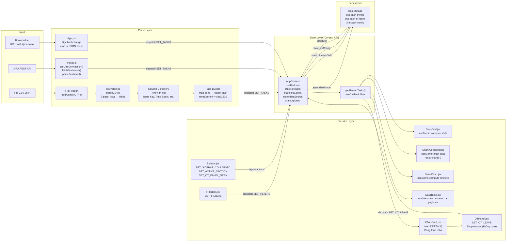

# Tài liệu Kiến trúc & Công nghệ

## JIRA Time Tracking Dashboard

| Trường           | Nội dung                                                     |
|------------------|---------------------------------------------------------------|
| **Dự án**        | JIRA Time Tracking Dashboard                                  |
| **Phiên bản**    | 3.0                                                           |
| **Ngày**         | 27/06/2026                                                    |
| **Repository**   | `jira-dashboard-react/`                                       |
| **Ngôn ngữ**     | JavaScript (ES Modules) + JSX                                 |
| **Loại ứng dụng**| Single-Page Application (SPA) — React 18                      |

---

## Mục lục

- [1. Tổng quan công nghệ](#1-tổng-quan-công-nghệ)
- [2. Kiến trúc hệ thống](#2-kiến-trúc-hệ-thống)
  - [2.1 Sơ đồ Component Tree](#21-sơ-đồ-component-tree)
  - [2.2 Sơ đồ luồng dữ liệu](#22-sơ-đồ-luồng-dữ-liệu)
- [3. Cấu trúc thư mục](#3-cấu-trúc-thư-mục)
- [4. Chi tiết công nghệ](#4-chi-tiết-công-nghệ)
  - [4.1 React 18](#41-react-18)
  - [4.2 Vite](#42-vite)
  - [4.3 Tailwind CSS](#43-tailwind-css)
  - [4.4 Framer Motion](#44-framer-motion)
  - [4.5 Chart.js + react-chartjs-2](#45-chartjs--react-chartjs-2)
  - [4.6 State Management (Context API + useReducer)](#46-state-management-context-api--usereducer)
  - [4.7 Lucide React](#47-lucide-react)
- [5. Xử lý dữ liệu](#5-xử-lý-dữ-liệu)
  - [5.1 CSV Parser](#51-csv-parser)
  - [5.2 Date Parsing](#52-date-parsing)
  - [5.3 Effort Calculation](#53-effort-calculation)
  - [5.4 Filter Logic](#54-filter-logic)
- [6. Triển khai (Deployment)](#6-triển-khai-deployment)
- [7. Hiệu năng](#7-hiệu-năng)
- [8. Bảo trì & Mở rộng](#8-bảo-trì--mở-rộng)

---

## 1. Tổng quan công nghệ

| Lĩnh vực              | Công nghệ                     | Phiên bản  | Mục đích                                            |
|-----------------------|-------------------------------|------------|-----------------------------------------------------|
| Frontend Framework    | React                         | 19.0       | Xây dựng giao diện component-based, SPA (React 18 APIs) |
| Build Tool            | Vite                          | 6.0        | Bundle ES modules, dev server HMR, production build |
| Styling               | Tailwind CSS                  | 4.0        | Utility-first CSS, dark mode via `dark:` prefix     |
| Charts                | Chart.js + react-chartjs-2    | 4.4.7 + 5.3| 5 biểu đồ phân tích dữ liệu JIRA                    |
| Animation             | Framer Motion                 | 12.0       | Stagger, AnimatePresence, layout animations         |
| State Management      | Context API + useReducer      | (React)    | State toàn cục: tasks, filters, dark mode, OT/leave |
| Icons                 | Lucide React                  | 0.400      | Sun, Moon, Clock, Upload icons                      |
| Date Handling         | Custom (`utils/dateUtils.js`) | —          | Parse JIRA date format, count working days          |
| CSV Parsing           | Custom (`utils/csvParser.js`) | —          | 2-pass parser: BOM, semicolon, quoted fields        |
| Plugin (Vite)         | @vitejs/plugin-react          | 4.3        | React Fast Refresh, JSX transform                   |
| Plugin (Vite)         | @tailwindcss/vite             | 4.0        | Tailwind CSS v4 integration                         |

**File cấu hình chính:**
- `C:\Users\Admin\Downloads\JIRA\jira-dashboard-react\package.json` — dependencies và scripts
- `C:\Users\Admin\Downloads\JIRA\jira-dashboard-react\vite.config.js` — cấu hình Vite (plugins, base)
- `C:\Users\Admin\Downloads\JIRA\jira-dashboard-react\index.html` — entry HTML
- `C:\Users\Admin\Downloads\JIRA\jira-dashboard-react\src\index.css` — CSS custom properties + Tailwind import

---

## 2. Kiến trúc hệ thống

### 2.1 Sơ đồ Component Tree

```mermaid
graph TB
    subgraph "React Component Tree (v3.0)"
        App["App.jsx<br/><b>AppProvider</b> (Context Provider)"]
        AppC["AppContent.jsx<br/>&lt;AnimatePresence mode=wait&gt;
        <br/>Đọc URL hash (bookmarklet)<br/>Lắng nghe hashchange"]
        
        subgraph "AppShell (Layout - always rendered)"
            AS["AppShell.jsx<br/>TopBar + Sidebar + Main"]
            TB["TopBar.jsx<br/>Breadcrumb, connection badge<br/>Theme toggle Sun/Moon<br/>Mobile menu button"]
            SB["Sidebar.jsx<br/>Tổng quan | Dữ liệu<br/>OT & Nghỉ phép | Kết nối JIRA<br/>Collapse/expand animation"]
        end
        
        subgraph "Before load (state.isLoaded === false)"
            JC["JiraConnect.jsx<br/>API Token form (URL, email, token, key, JQL)<br/>Bookmarklet generator + instructions"]
        end
        
        subgraph "After load (state.isLoaded === true)"
            D["Dashboard.jsx<br/>Data source info bar<br/>JQL used badge<br/>Overdue warning<br/>Auto-refresh interval<br/>Back-to-top button"]
            FB["FilterBar.jsx<br/>Sprint | Component<br/>Assignee | Date range<br/>Pill-style compact<br/>Reset filter button"]
            SG["StatsGrid.jsx<br/>5 cards (4 stats + Effort)<br/>Stagger animation<br/>AnimatedNumber"]
            CG["ChartGrid.jsx<br/>Grid container 2 cột"]
            GT["GanttChart.jsx<br/>HTML table timeline<br/>Tooltip, weekend markers"]
            DT["DataTable.jsx<br/>Sort, search, paginate<br/>20 rows/page, 8 columns<br/>Lucide sort icons"]
            OP["OTPanel.jsx<br/>Slide drawer (phải)<br/>Quick-add buttons (OT +0.5~8h, Leave +1.75~14h)<br/>Lưu → đóng panel"]
        end
        
        subgraph "Chart Components"
            SB["SprintBarChart.jsx<br/>Bar (nhóm)"]
            CB["ComponentBarChart.jsx<br/>Bar (ngang)"]
            DTC["DailyTrendChart.jsx<br/>Bar + Line (lũy kế)"]
            TDC["TypeDoughnutChart.jsx<br/>Doughnut"]
            AB["AssigneeBarChart.jsx<br/>Bar (ngang) full-width"]
        end

        subgraph "Utility Modules"
            CSV["csvParser.js<br/>parseCSV()"]
            DTU["dateUtils.js<br/>parseJiraDate, countWorkingDays<br/>fmtShortDate, daysBetween"]
            EFF["effortCalculator.js<br/>calculateEffort()<br/>Công thức: availableHr / totalHr"]
            EXP["exportUtils.js<br/>exportCSV, exportChartPNG<br/>COMP_COLORS, CHART_PALETTE"]
            JAPI["jiraApi.js<br/>testJiraConnection()<br/>fetchJiraIssues()<br/>parseJiraIssue()"]
        end

        subgraph "Data Sources"
            FILE[File CSV xuất từ JIRA]
            JIRA_API[JIRA REST API v3<br/>(qua Vite proxy hoặc direct)]
            BKML[Bookmarklet<br/>(URL hash #jira-data=)]
        end

        App --> AppC
        AppC --> AS
        AS --> TB
        AS --> SB
        AS --> JC
        AS --> D
        D --> FB
        D --> SG
        D --> CG --> SB & CB & DTC & TDC & AB
        D --> GT
        D --> DT
        D --> OP
        JC --> JAPI
        FILE --> CSV
        JIRA_API --> JAPI
        BKML -->|hashchange| AppC
        CSV -->|SET_TASKS| AppC
        JAPI -->|SET_TASKS| AppC
        SG --> EFF
        EFF --> DTU
    end

    style App fill:#6366f1,color:#fff,stroke:#4338ca
    style AS fill:#4f46e5,color:#fff
    style JC fill:#10b981,color:#fff
    style SG fill:#f59e0b,color:#fff
    style BKML fill:#8b5cf6,color:#fff
```

### 2.2 Sơ đồ luồng dữ liệu



**Chú thích luồng dữ liệu (v3.0):**

1. **Input (3 nguồn) → Parse:**
   - **CSV:** Người dùng kéo-thả file CSV → `UploadZone.jsx` (hiện tích hợp trong `JiraConnect.jsx`) đọc file qua `FileReader` → `csvParser.js` parse text → `Column Discovery` xác định vị trí từng cột → map thành mảng `Task` objects.
   - **JIRA API:** `JiraConnect.jsx` → `testJiraConnection()` (Basic Auth: email + API Token) → `fetchJiraIssues()` gọi `/rest/api/latest/search?jql=...` → `parseJiraIssue()` map response thành `Task[]`. Sử dụng Vite proxy (`/api/jira`) trong dev mode để bypass CORS; production gọi trực tiếp đến JIRA server.
   - **Bookmarklet:** Người dùng click bookmark trên tab JIRA → bookmarklet fetch dữ liệu (same-origin, auto-auth) → mở dashboard tab với `#jira-data=<base64>` → `App.jsx` đọc hash trên mount và qua `hashchange` event → giải mã base64 → dispatch `SET_TASKS`.
2. **Parse → State:** `tasks[]` được dispatch vào `AppContext` qua action `SET_TASKS` (useReducer). State lưu thêm `dataSource` ('csv'|'jira'|'jira-bookmarklet'), `jqlUsed`, `jiraConfig`, `lastRefreshTime`.
3. **State → Render:** `Dashboard.jsx` gọi `getFilteredTasks()` (useCallback) để lấy tasks đã lọc. Kết quả truyền xuống các component con qua props.
4. **User Interaction → State update:** `FilterBar` dispatch `SET_FILTERS` → state thay đổi → re-render. `OTPanel` dispatch `SET_OT_LEAVE` với `{ otTotal, leaveTotal }` → `EffortCard` tính lại effort (công thức ratio). `Sidebar` dispatch layout actions (`SET_SIDEBAR_COLLAPSED`, `SET_ACTIVE_SECTION`, `SET_OT_PANEL_OPEN`).
5. **Persistence:** Theme (`jira-dash-theme`), OT/leave (`jira-dash-ot-leave`), JIRA config (`jira-dash-config`) được đọc từ localStorage trong `AppProvider` initializer và ghi lại qua `useEffect`.

---

## 3. Cấu trúc thư mục

```
jira-dashboard-react/
├── index.html                    # Entry HTML (thẻ <div id="root">)
├── package.json                  # Dependencies, scripts
├── vite.config.js                # Vite config: base './', React + Tailwind plugins
│
├── src/
│   ├── main.jsx                  # Entry point: createRoot, StrictMode
│   ├── App.jsx                   # Root component: AppProvider → AppContent
│   ├── index.css                 # Tailwind import, CSS custom properties
│   │
│   ├── context/
│   │   └── AppContext.jsx        # Context API + useReducer: state, dispatch, actions
│   │
    │   ├── components/
    │   │   ├── layout/
    │   │   │   ├── AppShell.jsx      # App layout shell: TopBar + Sidebar + main content
    │   │   │   ├── Sidebar.jsx       # Sidebar navigation: Tổng quan, Dữ liệu, OT, Kết nối JIRA
    │   │   │   └── TopBar.jsx        # Fixed top bar: breadcrumb, connection badge, theme toggle
    │   │   ├── JiraConnect.jsx       # JIRA connection panel: API token OR Bookmarklet setup
    │   │   ├── Dashboard.jsx         # Main dashboard: data source info, auto-refresh, overview
    │   │   ├── FilterBar.jsx         # Sprint, Component, Assignee, Date range filters (pill-style)
    │   │   ├── StatsGrid.jsx         # 4 stat cards + EffortCard, stagger animation
    │   │   ├── EffortCard.jsx        # Effort ratio with gauge bar + status label
    │   │   ├── ChartGrid.jsx         # Grid container for 5 chart components
    │   │   ├── GanttChart.jsx        # Gantt timeline: HTML table, tooltip, legend
    │   │   ├── DataTable.jsx         # Sortable, searchable, paginated data table
    │   │   ├── OTPanel.jsx           # OT / Leave panel (slide drawer, quick-add buttons)
    │   │   │
    │   │   └── charts/
    │   │       ├── SprintBarChart.jsx        # Chargrouped bar: hours by sprint
    │   │       ├── ComponentBarChart.jsx     # Horizontal bar: hours by component
    │   │       ├── DailyTrendChart.jsx       # Bar + Line combo: daily + cumulative
    │   │       ├── TypeDoughnutChart.jsx     # Doughnut: hours by issue type
    │   │       └── AssigneeBarChart.jsx      # Horizontal bar: hours by assignee (full-width)
    │   │
    │   └── utils/
│       ├── csvParser.js          # parseCSV(): 2-pass, BOM, semicolon, quoted fields
│       ├── dateUtils.js          # parseJiraDate, countWorkingDays, fmtShortDate, etc.
│       ├── effortCalculator.js   # calculateEffort(): formula with OT/leave
│       └── exportUtils.js        # exportCSV, exportChartPNG, COMP_COLORS, CHART_PALETTE
│
└── dist/                         # Production build output (npm run build)
    └── index.html                # Entry HTML với paths relative (base: './')
```

**Thống kê:** 28+ source files (không tính node_modules/ và dist/), 18+ React components (gồm 3 layout components + JiraConnect), 5 utility modules (thêm jiraApi.js) + 1 Context module.

---

## 4. Chi tiết công nghệ

### 4.1 React 18

**Vị trí:** Toàn bộ ứng dụng — `src/main.jsx`, `src/App.jsx`, tất cả components trong `src/components/`.

**Đặc điểm triển khai:**

- **Functional components:** 100% functional components, không có class components.
- **Hooks được sử dụng:**
  - `useState` — local state trong `UploadZone.jsx` (dragOver, fileName), `OTPanel.jsx` (isOpen, otDate, leaveHours), `GanttChart.jsx` (showTooltip).
  - `useEffect` — trong `AppContext.jsx`: đồng bộ dark mode class vào `<html>`, persist OT/leave data vào localStorage.
  - `useMemo` — trong `StatsGrid.jsx` (tính stats), `DataTable.jsx` (lọc + sắp xếp + tìm kiếm), tất cả chart components (tính chart data), `FilterBar.jsx` (danh sách unique values), `GanttChart.jsx` (tính timeline), `EffortCard.jsx` (tính effort).
  - `useCallback` — trong `AppContext.jsx` (`getFilteredTasks`), `DataTable.jsx` (handleSort, handleSearch, goToPage), `UploadZone.jsx` (processFile, handleDrop).
  - `useReducer` — trong `AppContext.jsx` (reducer với 10+ action types).
  - `useContext` — trong `useApp()` custom hook (tất cả components cần state).
  - `useRef` — trong `UploadZone.jsx` (input file ref).

- **StrictMode:** `src/main.jsx` bao toàn bộ app trong `<StrictMode>` để phát hiện side effects không an toàn.

- **Custom Hook:** `useApp()` trong `AppContext.jsx` — wrapper cho `useContext(AppContext)`, throw error nếu dùng ngoài Provider.

### 4.2 Vite

**Vị trí:** `C:\Users\Admin\Downloads\JIRA\jira-dashboard-react\vite.config.js`

```javascript
import { defineConfig } from 'vite'
import react from '@vitejs/plugin-react'
import tailwindcss from '@tailwindcss/vite'

export default defineConfig({
  plugins: [react(), tailwindcss()],
  base: './',
})
```

**Chi tiết cấu hình:**

| Tính năng               | Giá trị          | Mục đích                                          |
|-------------------------|------------------|---------------------------------------------------|
| Plugin React            | `@vitejs/plugin-react` | JSX transform, React Fast Refresh (HMR)         |
| Plugin Tailwind CSS v4  | `@tailwindcss/vite`    | Tích hợp Tailwind CSS vào Vite build pipeline     |
| `base`                  | `'./'`           | Relative paths trong build, cho phép mở `dist/index.html` trực tiếp từ file:// |
| Dev server port         | 5173 (mặc định)   | `npm run dev`                                     |
| Output directory        | `dist/`          | `npm run build` → thư mục tĩnh                    |
| Vite Proxy              | `/api/jira` → JIRA server | Proxy CORS: `/api/jira/*` → `https://jira-server:3033/*`, `changeOrigin: true`, `secure: false` |

**Vite Proxy chi tiết:**

```javascript
// vite.config.js — proxy config
server: {
  proxy: {
    '/api/jira': {
      target: 'https://20.84.97.109:3033',  // JIRA server thật
      changeOrigin: true,
      rewrite: (path) => path.replace(/^\/api\/jira/, ''),
      secure: false,  // Cho phép self-signed certificate
      configure: (proxy) => {
        proxy.on('error', (err) => console.log('proxy error', err));
        proxy.on('proxyReq', (proxyReq, req) => {
          console.log('Proxying:', req.method, req.url, '→', proxyReq.path);
        });
      }
    }
  }
}
```

Proxy này cho phép frontend gọi `/api/jira/rest/api/latest/search` trong dev mode, Vite tự động chuyển tiếp đến JIRA server thật, giải quyết vấn đề CORS policy khi gọi API từ trình duyệt.

**Scripts** (từ `package.json`):
```bash
npm run dev       # Vite dev server + HMR (localhost:5173)
npm run build     # Production build → dist/
npm run preview   # Preview production build locally
```

**Hiệu năng build:**
- Build time: ~2.8 giây (với module cold start)
- Output size: ~200 KB gzipped (dist/)

### 4.3 Tailwind CSS

**Vị trí:** `src/index.css` (import + custom properties), tất cả components (utility classes).

**Đặc điểm triển khai:**

- **Import:** `@import "tailwindcss"` — Tailwind v4 zero-config import (không cần `tailwind.config.js`).
- **Dark Mode:** Dùng class strategy — class `.dark` trên `<html>` kích hoạt tất cả lớp `dark:`.
- **CSS Custom Properties** (trong `index.css`):
  ```css
  @layer base {
    :root {
      --color-bg: #f8fafc;
      --color-surface: #ffffff;
      --color-text: #1e293b;
      --color-muted: #64748b;
      --color-border: #e2e8f0;
    }
    .dark {
      --color-bg: #0f172a;
      --color-surface: #1e293b;
      --color-text: #e2e8f0;
      --color-muted: #94a3b8;
      --color-border: #334155;
    }
  }
  ```
- **Global transitions:** `* { transition: background-color 0.2s, color 0.2s, border-color 0.2s; }` — smooth theme switch. Canvas (Chart.js) loại trừ: `canvas { transition: none !important; }`.
- **Responsive:** Dùng breakpoints mặc định của Tailwind: `sm` (640px), `md` (768px), `lg` (1024px).
- **Utility classes phổ biến:**
  - Cards: `bg-white dark:bg-slate-800 rounded-2xl shadow-sm border border-slate-200 dark:border-slate-700 p-5`
  - Buttons: `px-4 py-2 bg-indigo-600 hover:bg-indigo-700 text-white rounded-lg text-sm font-medium transition-all cursor-pointer`
  - Grid: `grid grid-cols-1 md:grid-cols-2 lg:grid-cols-4 gap-4`
- **Zero custom CSS:** Không có file CSS nào ngoài `index.css`. Toàn bộ styling dùng utility classes.

### 4.4 Framer Motion

**Vị trí:** `src/App.jsx`, `src/components/*.jsx`, `src/components/layout/*.jsx`

**Đặc điểm triển khai:**

| Tính năng               | Component                    | Mô tả                                                              |
|-------------------------|------------------------------|--------------------------------------------------------------------|
| `AnimatePresence`       | `App.jsx` (mode: "wait")     | Chuyển đổi giữa JiraConnect (khi chưa có data) và Dashboard (khi có data) với exit animate. |
| `AnimatePresence`       | `AppShell.jsx`               | Mobile sidebar overlay (fade backdrop + slide drawer từ trái).     |
| `AnimatePresence`       | `OTPanel.jsx`                | Panel OT/Nghỉ phép mở/đóng với slide-in từ phải (spring stiffness 300, damping 30). |
| Stagger children        | `StatsGrid.jsx`              | 5 thẻ (4 stats + effort) xuất hiện lần lượt, mỗi card delay 0.05s (total delay * index). |
| `motion.div`            | `StatsGrid.jsx`              | `cardVariants`: hidden (opacity 0, y 12) → visible (delay theo index). |
| `motion.div`            | `Dashboard.jsx`              | key="dashboard" — animate opacity 0→1 khi mount.                    |
| `motion.div`            | `FilterBar.jsx`              | initial opacity 0, y -8 → animate opacity 1, y 0.                 |
| `motion.div`            | `DataTable.jsx`              | initial opacity 0, y 10 → animate.                                 |
| `motion.div`            | `GanttChart.jsx`             | initial opacity 0, y 15 → animate.                                 |
| `motion.div`            | `JiraConnect.jsx`            | initial opacity 0, y 12 → animate.                                 |
| `motion.div`            | `UploadZone.jsx`             | initial opacity 0, y 20 → animate. Scale spring khi dragOver.      |
| `motion.div`            | `EffortCard.jsx`             | Progress bar `animate.width` từ 0 → gaugePercent% (duration 0.6s, easeOut). |
| `motion.button`         | `Sidebar.jsx`                | Collapse/expand indicator `layoutId="activeIndicator"` với spring animation. |
| `motion.button`         | Chart components             | initial opacity 0, y 15 → animate, delay tăng dần (0.1–0.4s).      |
| `AnimatedNumber`        | `StatsGrid.jsx`              | `motion.div` keyed by display value — animate opacity + y khi số thay đổi. |
| `motion.button` (sidebar)| `Sidebar.jsx`               | `whileHover={{ scale: 1.02 }}` + `whileTap={{ scale: 0.98 }}` trên navigation items. |
| `motion.button` (theme) | `TopBar.jsx`                 | Sun/Moon icon xoay 90 độ khi chuyển đổi (key="sun"/"moon"), `whileTap={{ scale: 0.9 }}`. |

### 4.5 Chart.js + react-chartjs-2

**Vị trí:** `src/components/charts/*.jsx`

**Đặc điểm triển khai:**

- **5 chart types:**
  1. `SprintBarChart.jsx` — **Bar (nhóm):** 2 dataset (Giờ đã log + Giờ ước tính) song song. Sắp xếp sprint theo số.
  2. `ComponentBarChart.jsx` — **Bar (ngang):** Màu sắc theo component dùng `getComponentColor()`. Index axis.
  3. `DailyTrendChart.jsx` — **Bar + Line combo:** Bar dataset (Giờ theo ngày) + Line dataset (Lũy kế) với fill + tension (0.3) loại bỏ.
  4. `TypeDoughnutChart.jsx` — **Doughnut:** Cutout 55%. Legend bottom. Tooltip hiển thị giờ + %.
  5. `AssigneeBarChart.jsx` — **Bar (ngang) full-width:** Col-span 2 trên desktop. Màu từ `CHART_PALETTE`.

- **Chart.js registration:** Mỗi chart component tự đăng ký các thành phần cần thiết (`ChartJS.register(...)`). Các module đã đăng ký: `CategoryScale`, `LinearScale`, `BarElement`, `LineElement`, `PointElement`, `ArcElement`, `Title`, `Tooltip`, `Legend`, `Filler`.

- **react-chartjs-2:** Sử dụng các component `<Bar>`, `<Doughnut>` thay vì `new Chart()` trực tiếp. Data và options được tính bằng `useMemo` phụ thuộc vào `tasks`.

- **Responsive:** Tất cả chart có `responsive: true, maintainAspectRatio: false`. Chiều cao cố định 300px (assignee: 350px) qua container `div.relative.h-[300px]`.

- **Vietnamese labels:** Tất cả labels, tooltips, axis titles đều bằng tiếng Việt.

- **Palette:** `CHART_PALETTE` trong `exportUtils.js` — 12 màu: `['#6366f1', '#10b981', '#f59e0b', '#ef4444', '#8b5cf6', '#06b6d4', '#ec4899', '#14b8a6', '#f97316', '#a855f7', '#84cc16', '#e11d48']`.

- **Component colors:** `COMP_COLORS` trong `exportUtils.js` — màu cố định cho từng component (VOS → indigo, Violation → red, etc.).

### 4.6 State Management (Context API + useReducer)

**Vị trí:** `src/context/AppContext.jsx`

**Kiến trúc:**

```
AppProvider (useReducer)
  │
  ├── state (đối tượng state toàn cục)
  ├── dispatch (hàm dispatch actions)
  └── getFilteredTasks (useCallback: trả về tasks đã lọc)
       │
       ├── value={state, dispatch, getFilteredTasks}
       │
       └── AppContext.Provider
             │
             └── {children} (toàn bộ app)
```

**State shape:**
```javascript
const initialState = {
  allTasks: [],              // Mảng Task objects (dữ liệu gốc)
  filters: {                // Bộ lọc hiện tại
    sprint: '',
    component: '',
    assignee: '',
    dateFrom: '',
    dateTo: '',
  },
  otLeaveData: {            // Dữ liệu OT và nghỉ phép
    otHours: {},            // { "2026-06-01": 2, "2026-06-02": 3 }
    leaveHours: {},         // { "2026-06-05": 8 }
  },
  isLoaded: false,          // Đã có dữ liệu chưa
  error: null,              // Thông báo lỗi
  loading: false,           // Đang xử lý
  fileName: '',             // Tên file CSV
  fileStats: '',            // Thống kê file
  tableVisible: true,       // Hiển thị bảng dữ liệu
  tableSortCol: 'timeSpentHr',  // Cột sắp xếp
  tableSortDir: 'desc',     // Hướng sắp xếp
  tablePage: 1,             // Trang hiện tại
  tableSearchTerm: '',      // Từ khóa tìm kiếm
  darkMode: false,          // Dark mode
};
```

**Actions:**
| Action Type       | Payload              | Mô tả                                       |
|-------------------|----------------------|----------------------------------------------|
| `SET_TASKS`       | `Task[]`             | Load dữ liệu tasks từ CSV parser             |
| `SET_FILTERS`     | `filters object`     | Cập nhật bộ lọc                              |
| `SET_OT_LEAVE`    | `otLeaveData object` | Cập nhật OT/leave data                       |
| `SET_FILE_INFO`   | `{ fileName, fileStats }` | Thông tin file CSV                     |
| `SET_LOADING`     | `boolean`            | Trạng thái loading                           |
| `RESET`           | —                    | Reset về initialState (giữ darkMode + otLeave) |
| `SET_ERROR`       | `string`             | Hiển thị lỗi                                 |
| `SET_TABLE_VISIBLE` | `boolean`         | Toggle bảng dữ liệu                          |
| `SET_TABLE_SORT`  | `{ col, dir }`       | Sắp xếp bảng                                 |
| `SET_TABLE_PAGE`  | `number`             | Chuyển trang                                 |
| `SET_TABLE_SEARCH` | `string`            | Tìm kiếm trong bảng                          |
| `SET_DARK_MODE`   | `boolean`            | Chuyển đổi dark/light theme                  |

**Persisted state:** Khởi tạo qua `initializer` function (tham số thứ 3 của `useReducer`):
- **Dark mode:** Đọc từ `localStorage.getItem('jira-dash-theme')`. Fallback: `window.matchMedia('(prefers-color-scheme: dark)')`.
- **OT/Leave data:** Đọc từ `localStorage.getItem('jira-dash-ot-leave')`.

**Side effects đồng bộ qua `useEffect`:**
- `darkMode` thay đổi → sync class `.dark` vào `document.documentElement` + lưu localStorage.
- `otLeaveData` thay đổi → lưu localStorage.

### 4.7 Lucide React

**Vị trí:** `src/components/layout/TopBar.jsx` — `Sun`, `Moon` icons; `src/components/UploadZone.jsx` — `Upload` icon; `src/components/OTPanel.jsx` — `Clock` icon.

| Icon      | Component          | Mục đích                  |
|-----------|-------------------|---------------------------|
| `Sun`     | `TopBar.jsx`       | Dark mode: hiển thị khi đang ở dark mode → click để chuyển sang light |
| `Moon`    | `TopBar.jsx`       | Light mode: hiển thị khi đang ở light mode → click để chuyển sang dark |
| `Upload`  | `UploadZone.jsx`   | Icon upload trong vùng kéo-thả file       |
| `Clock`   | `OTPanel.jsx`      | Icon đồng hồ cho nút toggle OT/Nghỉ       |

Lucide React cung cấp icon dưới dạng React components, hỗ trợ `className`, `strokeWidth`, `size` props — dễ dàng custom kích thước và màu sắc với Tailwind.

---

## 5. Xử lý dữ liệu

### 5.1 CSV Parser

**Vị trí:** `src/utils/csvParser.js`

**Thuật toán 2-pass:**

```
Pass 1 — Split rows by newline (xử lý quoted newlines)
  Input: Raw text từ FileReader
  Output: Mảng rows (mỗi row là một string)

Pass 2 — Split each row by semicolon (xử lý quoted fields)
  Input: Mảng rows (string)
  Output: Mảng 2 chiều fields (string[][])
```

**Xử lý BOM (Byte Order Mark):**
```javascript
// Unicode U+FEFF
text = text.replace(/^\uFEFF/, '');
// Raw UTF-8 bytes EF BB BF (fallback)
if (text.length >= 3 && text.charCodeAt(0) === 0xEF && text.charCodeAt(1) === 0xBB && text.charCodeAt(2) === 0xBF) {
  text = text.slice(3);
}
```

**Xử lý line endings:** Chuẩn hóa `\r\n` → `\n`, `\r` → `\n`.

**Xử lý quoted fields trong Pass 1:**
- Duyệt từng ký tự, theo dõi trạng thái `inQuotes`.
- Chỉ split theo `\n` khi `inQuotes === false`.
- Bỏ qua dòng trống (`.trim()` rỗng).

**Xử lý quoted fields trong Pass 2:**
- Duyệt từng ký tự, theo dõi trạng thái `quoted`.
- `""` (double quote escape) → `"`.
- Chỉ split theo `;` khi `quoted === false`.

### 5.2 Date Parsing

**Vị trí:** `src/utils/dateUtils.js`

**Định dạng JIRA:** `"02/Jun/26 1:43 PM"` — 2-digit year, month abbreviation, 12-hour clock.

**Regex:**
```javascript
/^(\d{1,2})\/([A-Za-z]{3})\/(\d{2})\s+(\d{1,2}):(\d{2})(?::(\d{2}))?\s*(AM|PM)$/i
```

**Xử lý:**
1. Map month abbreviation (3 ký tự đầu) → month index qua `MONTH_MAP` (jan→0, feb→1, ..., dec→11).
2. Year: `2000 + parseInt(year, 10)`.
3. Hour: AM/PM adjustment (PM +12, 12 AM → 0).

**Các hàm tiện ích:**
| Hàm                          | Mô tả                                           |
|------------------------------|--------------------------------------------------|
| `parseJiraDate(str)`         | Parse string JIRA → Date object (hoặc null)     |
| `fmtShortDate(d)`            | Date → "dd/MM"                                   |
| `toDateStr(d)`               | Date → "dd/MM/yy"                                |
| `daysBetween(a, b)`          | Số ngày giữa 2 Date                              |
| `addDays(d, n)`              | Date + n ngày                                    |
| `normalizeDay(d)`            | Reset về 00:00:00                                |
| `countWorkingDays(year, month)` | Đếm ngày làm việc (loại thứ 7, CN)            |

### 5.3 Effort Calculation

**Vị trí:** `src/utils/effortCalculator.js`

**Công thức (UPDATED — ratio, not percentage):**
```
availableHr = workingDays × 7 + OT - leave
Effort = availableHr / totalHr       (ratio, không nhân 100)
```

**Diễn giải:**
- **Effort < 1:** Tốt (đã log nhiều hơn giờ chuẩn) → ✅ Vượt, gauge xanh
- **Effort = 1:** Vừa đủ → ✅ Đủ, gauge vàng
- **Effort > 1:** Chưa log đủ → ⚠️ Thiếu, gauge đỏ, hiển thị cảnh báo "Kiểm tra lại xem đã log đủ task chưa"

**Thuật toán:**
1. Xác định **primary month** — tháng có nhiều task nhất (dùng `resolved || created`).
2. Đếm **working days** trong tháng đó qua `countWorkingDays(year, month)` (loại thứ 7 và CN).
3. Lấy **tổng OT** và **tổng nghỉ** từ `otLeaveData.otTotal` / `otLeaveData.leaveTotal` (dạng số, không còn lưu theo ngày).
4. **availableHr** = `workingDays × 7 + otTotal - leaveTotal`.
5. **Effort** = `availableHr / totalHr` (nếu `totalHr > 0`); nếu không → `effort = 0`.

**Detail string** (hiển thị trong tooltip):
```
"22 ngày × 7h + 4.0h OT - 8.0h nghỉ = 150.0h chuẩn / 155.7h đã log"
```

**Hiển thị EffortCard:**
- Giá trị số thập phân (ví dụ `0.963`) — 3 chữ số thập phân
- Gauge bar: width = `min(100, 1/effort × 100)`%
- Màu: `--success` (xanh) nếu < 1, `--warning` (vàng) nếu ≈ 1, `--danger` (đỏ) nếu > 1
- Cảnh báo đỏ: "Effort > 1 — kiểm tra lại xem đã log đủ task chưa"

### 5.4 Bookmarklet Cross-Origin Data Transfer

**Vị trí:** `src/components/JiraConnect.jsx` (UI + code generation), `src/App.jsx` (URL hash reader)

**Cơ chế:** Dành cho người dùng không có quyền API JIRA. Bookmarklet chạy trên trang JIRA (cùng origin → tự động xác thực qua session cookie), fetch dữ liệu qua XMLHttpRequest, chuyển đến dashboard qua URL hash.

**Luồng hoạt động:**

1. **Tạo Bookmarklet:** Người dùng nhập project key + JQL (tùy chọn) → ứng dụng sinh ra đoạn code `javascript:(function(){...})()`.
2. **Copy & Lưu:** Người dùng copy code → tạo bookmark mới trên trình duyệt, paste vào ô URL.
3. **Kích hoạt:** Người dùng mở trang JIRA (đã đăng nhập) → click bookmark.
4. **Fetch:** Bookmarklet gửi `XMLHttpRequest` đến `/rest/api/latest/search?jql=...&maxResults=500` trên cùng origin JIRA → tự động gửi session cookie.
5. **Parse:** Xử lý sprint data từ nhiều custom field IDs (`customfield_10020`, `10010`, `10007`, `10002`, `10021`, `10100`) → parse string format bằng regex `/name=([^,]+)/`.
6. **Transfer (Cross-Origin):** Bookmarklet mã hóa dữ liệu dạng JSON → `btoa(encodeURIComponent(JSON.stringify(data)))` → mở tab dashboard với `#jira-data=<base64>` trong URL.
7. **Nhận:** `App.jsx` `useEffect` lắng nghe `hashchange` event và đọc `window.location.hash` trên mount → giải mã `atob(decodeURIComponent(hash))` → dispatch `SET_TASKS`.

**Xử lý URL hash trong App.jsx:**

```javascript
// Đọc URL hash trên mount
const hash = window.location.hash;
if (hash.startsWith('#jira-data=')) {
  const encoded = hash.replace('#jira-data=', '');
  const json = decodeURIComponent(escape(atob(encoded)));
  const data = JSON.parse(json);
  // → dispatch SET_TASKS
}
// Lắng nghe hashchange (bookmarklet cập nhật tab hiện tại)
window.addEventListener('hashchange', readHash);
```

**Ưu điểm:** Không cần API token, không cần quyền admin, dùng cookie đăng nhập sẵn có. Không gửi dữ liệu qua server trung gian — end-to-end trên client.

### 5.5 Filter Logic

**Vị trí:** `AppContext.jsx` (`getFilteredTasks`) và `Dashboard.jsx`, `DataTable.jsx`.

**Logic AND giữa các tiêu chí:**
```javascript
const filtered = allTasks.filter(t => {
  if (f.sprint && t.primarySprint !== f.sprint) return false;
  if (f.component && !t.comps.includes(f.component)) return false;
  if (f.assignee && t.assignee !== f.assignee) return false;
  if (f.dateFrom) {
    const d = new Date(f.dateFrom);
    if (t.resolved && t.resolved < d) return false;
    if (!t.resolved && t.created && t.created < d) return false;
  }
  if (f.dateTo) {
    const d = new Date(f.dateTo);
    d.setHours(23, 59, 59);
    if (t.resolved && t.resolved > d) return false;
    if (!t.resolved && t.created && t.created > d) return false;
  }
  return true;
});
```

**Đặc điểm:**
- Giá trị rỗng (`''`) = không lọc (bỏ qua tiêu chí đó).
- Date range: dùng `resolved` nếu có, fallback về `created`.
- Sprint multi-value: dùng `primarySprint` (sprint cuối cùng của task).
- Component multi-value: dùng `t.comps.includes()` (task có component trong danh sách).

---

## 6. Triển khai (Deployment)

### Môi trường phát triển

```bash
# Clone repository
cd jira-dashboard-react

# Cài đặt dependencies (yêu cầu Node.js 18+)
npm install

# Chạy dev server (có Vite proxy cho JIRA API)
npm run dev
# → localhost:5173 (HMR — Hot Module Replacement)
```

**Vite Proxy trong dev mode:**
- Frontend gọi `/api/jira/rest/api/latest/search?jql=...` → Vite proxy chuyển tiếp đến JIRA server thật (ví dụ `https://20.84.97.109:3033`).
- Giải quyết CORS policy — trình duyệt chỉ thấy request đến cùng origin `localhost:5173`.
- Cấu hình trong `vite.config.js` — `server.proxy` với `changeOrigin: true`, `secure: false`.
- Chỉ hoạt động trong dev mode (`npm run dev`). Production build cần JIRA server hỗ trợ CORS hoặc dùng bookmarklet.

### Production build

```bash
# Build
npm run build
# → dist/ (thư mục output)

# Preview build locally
npm run preview
# → localhost:4173
```

### File protocol compatibility

Nhờ cấu hình `base: './'` trong `vite.config.js`, thư mục `dist/` có thể mở trực tiếp từ ổ cứng:

```
file:///C:/Users/Admin/Downloads/JIRA/jira-dashboard-react/dist/index.html
```

**Không yêu cầu web server** — tất cả paths trong build output đều là relative (`./assets/index-xxxx.js`).

### Deploy lên web server

Copy toàn bộ thư mục `dist/` lên web server (Apache, Nginx, Netlify, Vercel, GitHub Pages):

```
dist/
├── index.html
├── assets/
│   ├── index-xxxx.js       # JS bundle (Vite tree-shaken)
│   └── index-xxxx.css      # CSS bundle (Tailwind)
```

**Lưu ý:** Vì là SPA, không cần cấu hình fallback routing (toàn bộ app là single page).

---

## 7. Hiệu năng

### Vite tree-shaking

- Vite sử dụng Rollup dưới nền để tree-shake: chỉ bundle những module và export được import.
- `react-chartjs-2` register: chỉ register các Chart.js components cần thiết (CategoryScale, BarElement, ArcElement, v.v.) — không bundle toàn bộ Chart.js.

### React memo optimization

- `useMemo` được dùng rộng rãi: tính toán stats (StatsGrid), chart data (Chart components), filtered+sorted data (DataTable), timeline (Gantt).
- `useCallback` cho các hàm dispatch (handleSort, handleSearch) và process functions.
- **Chưa dùng `React.memo`** — hiệu năng hiện tại đáp ứng tốt với dữ liệu ≤1000 task.

### Build size analysis

| Thành phần           | Kích thước (ước lượng) |
|----------------------|------------------------|
| React + ReactDOM     | ~130 KB (unminified)   |
| Chart.js (v4)        | ~200 KB (unminified)   |
| Framer Motion        | ~150 KB (unminified)   |
| Tailwind CSS (purged)| ~37 KB (CSS bundle)    |
| App code (components + utils)| ~80 KB (unminified)  |
| **Total JS bundle**  | **~600 KB** (unminified) |
| **Total CSS**        | **~37 KB**             |

### Lazy loading

- Hiện tại chưa có dynamic import (code-splitting) — tất cả bundle trong một file `.js`.
- Có thể thêm `React.lazy()` cho các chart components nếu cần tối ưu thêm.
- Chart.js đã được register module-wise, không bundle toàn bộ.

### Build time

- Cold build: ~2.8 giây (Windows 10, SSD).
- Incremental build (sau khi thay đổi 1 file): <500ms.

---

## 8. Bảo trì & Mở rộng

### Component-based architecture

Kiến trúc component rõ ràng, mỗi component có một trách nhiệm duy nhất:

| Component            | Trách nhiệm                                  | Props/Context dependency         |
|----------------------|----------------------------------------------|----------------------------------|
| `App` + `AppContent` | Root layout, URL hash reader (bookmarklet), error/loading state | AppContext                    |
| `AppShell`           | Layout shell: TopBar + Sidebar + main content, mobile drawer overlay | state.sidebarCollapsed, mobileOpen |
| `TopBar`             | Breadcrumb, connection status badge, theme toggle Sun/Moon, mobile menu | useApp (state, dispatch)         |
| `Sidebar`            | Navigation (4 items), collapse/expand animation, active indicator | useApp (state, dispatch)         |
| `JiraConnect`        | JIRA connection panel (API Token form + Bookmarklet generator + instructions) | useApp (state, dispatch), jiraApi.js |
| `Dashboard`          | Data source info bar, JQL badge, auto-refresh interval, overdue warning, back-to-top | useApp (state, dispatch), fetchJiraIssues |
| `FilterBar`          | Filter controls (pill-style compact), unique value computation | useApp (state, dispatch)         |
| `StatsGrid`          | 4 stat cards + EffortCard, stagger animation, AnimatedNumber | tasks prop                      |
| `EffortCard`         | Effort ratio display (gauge bar + status label + warning) | tasks prop, state.otLeaveData |
| `ChartGrid`          | Grid of 5 chart components                   | tasks prop                      |
| `GanttChart`         | Gantt timeline table                         | tasks prop                      |
| `DataTable`          | Sortable/searchable/paginated table (8 columns, 20 rows/page) | useApp (state, dispatch)         |
| `OTPanel`            | OT/Leave slide drawer (no date — simple totals, quick-add buttons) | useApp (state, dispatch)         |

### Context API → dễ thêm state

Để thêm một state mới:
1. Thêm field vào `initialState` (AppContext.jsx).
2. Thêm case trong `reducer` function.
3. Dispatch action từ component mới.
4. (Tùy chọn) Thêm persistence trong `useEffect`.

Ví dụ — thêm `userName` state:
```javascript
// AppContext.jsx
const initialState = { ...userName: '' };

function reducer(state, action) {
  switch (action.type) {
    case 'SET_USER_NAME':
      return { ...state, userName: action.payload };
    // ...
  }
}
```

### Utility modules → reusable logic

| Module             | Hàm               | Có thể tái sử dụng cho               |
|--------------------|-------------------|---------------------------------------|
| `csvParser.js`     | `parseCSV()`      | Bất kỳ ứng dụng nào cần parse CSV semicolon JIRA-format |
| `dateUtils.js`     | `parseJiraDate()` | Parse date từ JIRA exports            |
| `dateUtils.js`     | `countWorkingDays()` | Tính ngày công trong tháng         |
| `effortCalculator.js` | `calculateEffort()` | Tính effort %                     |
| `exportUtils.js`   | `exportCSV()`     | Export CSV từ mảng objects            |

### Cách thêm một biểu đồ mới

1. Tạo file mới trong `src/components/charts/`, ví dụ `PriorityBarChart.jsx`.
2. Sử dụng pattern hiện có:
   ```javascript
   import { motion } from 'framer-motion';
   import { Bar } from 'react-chartjs-2';
   import { useMemo } from 'react';
   // ChartJS.register(...)
   
   export default function PriorityBarChart({ tasks }) {
     const chartData = useMemo(() => {
       // Tính toán data từ tasks
       return { labels, datasets };
     }, [tasks]);
     
     const options = { responsive: true, maintainAspectRatio: false, /* ... */ };
     
     return (
       <motion.div initial={{ opacity: 0, y: 15 }} animate={{ opacity: 1, y: 0 }}
         className="bg-white dark:bg-slate-800 rounded-2xl shadow-sm border border-slate-200 dark:border-slate-700 p-5">
         <h3 className="text-sm font-semibold">Tiêu đề biểu đồ</h3>
         <div className="relative h-[300px]"><Bar data={chartData} options={options} /></div>
       </motion.div>
     );
   }
   ```
3. Thêm vào `ChartGrid.jsx`:
   ```javascript
   import PriorityBarChart from './charts/PriorityBarChart';
   // Trong grid: <PriorityBarChart tasks={tasks} />
   ```

### Cách thêm một bộ lọc mới

1. Thêm field vào `state.filters` trong `initialState` (AppContext.jsx).
2. Cập nhật `getFilteredTasks()` với logic lọc mới.
3. Thêm control vào `FilterBar.jsx`:
   ```javascript
   <div className="flex flex-col gap-1">
     <label>Bộ lọc mới</label>
     <select value={state.filters.newFilter} onChange={(e) => updateFilter('newFilter', e.target.value)}>
       <option value="">Tất cả</option>
       {values.map(v => <option key={v} value={v}>{v}</option>)}
     </select>
   </div>
   ```

### Cách thêm một action mới cho AppContext

1. Thêm type string (ví dụ `'SET_NEW_FEATURE'`) vào `reducer`.
2. Dispatch từ component:
   ```javascript
   dispatch({ type: 'SET_NEW_FEATURE', payload: value });
   ```
3. Đọc state từ component khác:
   ```javascript
   const { state } = useApp();
   // state.newFeature
   ```

---

*Hết tài liệu Kiến trúc & Công nghệ — JIRA Time Tracking Dashboard v3.0*

*Tham khảo thêm: `SRS-JIRA-Dashboard.md` — Đặc tả yêu cầu phần mềm đầy đủ.*
